# Persistence in LangGraph

> **One-line summary:** Persistence is LangGraph's ability to save and restore the state of a workflow over time — storing not just the final state, but every intermediate state at every checkpoint — which is what makes memory, fault tolerance, human-in-the-loop, and time travel possible.

---

## Overview

By default, a LangGraph workflow is **ephemeral**. You invoke a graph, an input flows from `START` through your nodes, the state mutates along the way, you get a final result — and then everything in the state is wiped from RAM. If you need those values tomorrow, or even five seconds later in a new process, they're gone.

**Persistence** changes that core behavior. It lets you write the state to a durable store (a database) so it can be read back later. And critically, it doesn't just snapshot the *final* state — it snapshots the state at *every step* of execution.

This is a **foundational** topic. Four of LangGraph's headline features are built directly on top of it:

| Feature | Why it needs persistence |
|---|---|
| **Short-term memory** | Resume a past chat → past messages must have been stored |
| **Fault tolerance** | Restart after a crash → you must know where you stopped |
| **Human-in-the-loop** | Pause for hours/days → the paused state must survive |
| **Time travel** | Replay from step N → step N's state must exist |

If you skip persistence, none of the above work. Learn it once, and the rest fall into place.

---

## Recap: The Two Ideas Persistence Builds On

Before persistence makes sense, two earlier LangGraph concepts need to be fresh.

### 1. The Graph

Any high-level goal can be **decomposed into a set of tasks**, and those tasks can be represented as a graph:

- **Nodes** = individual tasks
- **Edges** = execution order (which task runs after which)

### 2. The State

Every workflow needs some important data to do its job. A chatbot needs its **messages**; a joke generator needs its **topic**. That data lives in the **state**, which is nothing but a dictionary.

The key property: **every node can both read from and write to the state.**

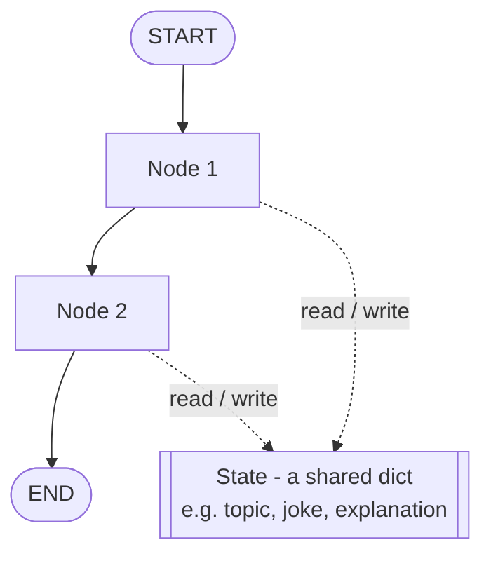

With just these two ideas you can build arbitrarily complex LLM workflows. What you *cannot* do — without persistence — is keep anything after execution finishes.

---

## The Problem: State Is Erased After Execution

Watch what happens on a normal `invoke()`:

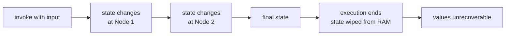

This is LangGraph's **default core behavior**. Persistence is the switch that turns it off.

| | Without persistence | With persistence |
|---|---|---|
| Where state lives | RAM only | RAM **+** a database |
| Lifetime of state | Until `invoke()` returns | Indefinite |
| Intermediate values | Discarded as you go | All saved |
| Can resume after a crash? | No — restart from scratch | Yes — from the crash point |
| Can resume an old chat? | No | Yes |
| Can inspect what happened at step 2? | No | Yes |

---

## Core Idea: Persistence Saves *Every* Intermediate State

This is the single most important property, and the one people miss.

Persistence does **not** only store the final value of your state. It stores the state at **every stage** of execution.

Take a workflow with one state variable, `name`:

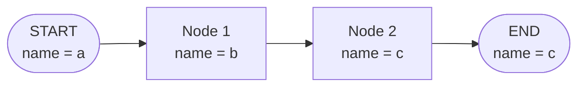

Without persistence you'd end up with exactly one value: `c`.

With persistence, all four of these are written to the database:

```
saved: name = a   (before Node 1 runs)
saved: name = b   (after Node 1)
saved: name = c   (after Node 2)
saved: name = c   (at END)
```

That's why the definition says "over time," not "at the end." **Persistence in LangGraph refers to the ability to save and restore the state of a workflow over time.**

This is precisely what enables fault tolerance: if the workflow crashes inside Node 2 — the server went down, an API you were calling went down, whatever — you already have the state as of Node 1 on disk. Re-trigger the workflow and it restarts **from the crash point**, not from `START`.

---

## Checkpointers and Checkpoints

Persistence in LangGraph is implemented through an object called a **checkpointer**.

**What a checkpointer does:**
1. Divides the entire graph execution into **checkpoints**.
2. At every checkpoint, saves whatever is currently in the state to a store.

### How checkpoints are decided: supersteps

**Every superstep of your graph becomes a checkpoint.**

A **superstep** is one "wave" of execution. Nodes that run in **parallel** are collapsed into a *single* superstep.

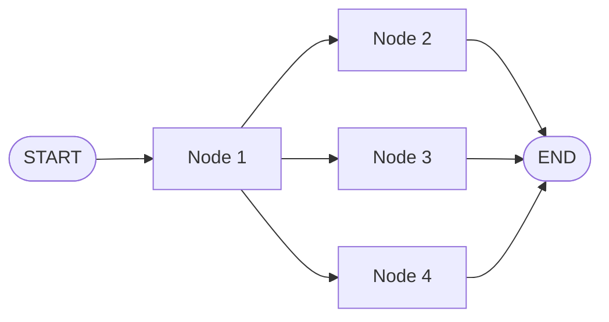

Breaking that graph into supersteps:

```
Superstep 1:  START -> Node 1
Superstep 2:  Node 1 -> {Node 2, Node 3, Node 4}   <- parallel, counts as ONE
Superstep 3:  {Node 2, Node 3, Node 4} -> END      <- parallel, counts as ONE
```

Three supersteps → checkpoints get placed at each boundary:

```
   [cp1]        [cp2]                      [cp3]        [cp4]
     |            |                          |            |
   START ----> Node 1 ----> Node 2/3/4 ----> END
```

At **each** of those markers, the checkpointer writes the current state to the database.

### Worked example: checkpoints with a reducer

State:

```python
from typing import Annotated, TypedDict
from operator import add

class NumberState(TypedDict):
    # the reducer MERGES incoming values instead of replacing them
    numbers: Annotated[list[int], add]
```

Execution with the graph above, starting with `numbers = [1]`:

| Checkpoint | Where | `numbers` saved |
|---|---|---|
| cp1 | before Node 1 | `[1]` |
| cp2 | after Node 1 produces `2` | `[1, 2]` |
| cp3 | after Nodes 2/3/4 produce `3, 4, 5` | `[1, 2, 3, 4, 5]` |
| cp4 | at END, nothing changes | `[1, 2, 3, 4, 5]` |

Result: **four state snapshots in the database**, because the graph had four checkpoints.

> Note the reducer's effect at cp2 — `2` is **merged/appended**, not **replaced**. Without `Annotated[list[int], add]`, `numbers` would just become `[2]`.

---

## Threads: Isolating One Execution From Another

Now a problem appears. Suppose you invoke the *same* workflow twice with different inputs:

```
Run A:  numbers = [1]  ->  [1,2]  ->  [1,2,3,4,5]
Run B:  numbers = [6]  ->  [6,7]  ->  [6,7,8,9,10]
```

Both runs write all their checkpoints to the **same database**. So how do you later pull back *only* Run A's values?

**Answer: threads.**

Every time you execute a persisted workflow, you assign it a **`thread_id`**. All state written during that execution is stored **against that thread_id**.

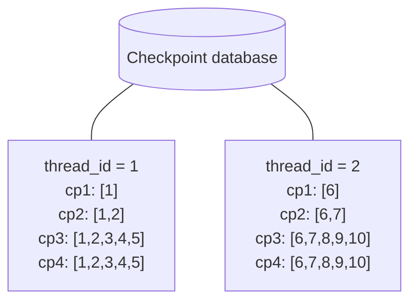

To get Run B back, you ask the database for everything under `thread_id = 2`. Done.

### Why this maps perfectly onto chatbots

A thread **is** a conversation.

```
User clicks "New chat"          -> create thread_id = 1
All messages this session       -> stored against thread_id = 1
Two days later, "New chat"      -> create thread_id = 2
User clicks an old conversation -> look up its thread_id, fetch all messages
                                   -> full chat history restored, resume from there
```

Without persistence, there is no "resume chat" button. Nothing was ever stored.

---

## Implementation: Code Walkthrough

### The example workflow

A simple sequential graph: given a topic, generate a joke, then generate an explanation of that joke.

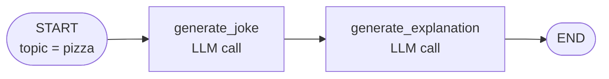

### Full code

```python
from typing import TypedDict

from langgraph.graph import StateGraph, START, END
from langgraph.checkpoint.memory import InMemorySaver   # <-- the checkpointer
from langchain_openai import ChatOpenAI

llm = ChatOpenAI(model="gpt-4o-mini")


# ---------- 1. State ----------
class JokeState(TypedDict):
    topic: str
    joke: str
    explanation: str


# ---------- 2. Nodes ----------
def generate_joke(state: JokeState):
    prompt = f"Generate a joke on the topic: {state['topic']}"
    response = llm.invoke(prompt).content
    return {"joke": response}


def generate_explanation(state: JokeState):
    prompt = f"Write an explanation for the joke: {state['joke']}"
    response = llm.invoke(prompt).content
    return {"explanation": response}


# ---------- 3. Graph ----------
graph = StateGraph(JokeState)
graph.add_node("generate_joke", generate_joke)
graph.add_node("generate_explanation", generate_explanation)

graph.add_edge(START, "generate_joke")
graph.add_edge("generate_joke", "generate_explanation")
graph.add_edge("generate_explanation", END)


# ---------- 4. Persistence: create a checkpointer and compile with it ----------
checkpointer = InMemorySaver()
workflow = graph.compile(checkpointer=checkpointer)
```

Those last two lines are the *entire* persistence setup. Passing `checkpointer=` to `compile()` tells LangGraph: save every state value — intermediate **and** final — through this checkpointer.

### Executing with a thread_id

```python
config1 = {"configurable": {"thread_id": "1"}}

result = workflow.invoke({"topic": "pizza"}, config=config1)
# {'topic': 'pizza', 'joke': '...', 'explanation': '...'}
```

The `config` dict carrying `thread_id` is **mandatory** once a checkpointer is attached. Everything written during this run is tagged with `thread_id = "1"`.

### Reading the final state back

```python
workflow.get_state(config1)
# StateSnapshot(
#   values={'topic': 'pizza', 'joke': '...', 'explanation': '...'},
#   next=(),
#   config={'configurable': {'thread_id': '1', 'checkpoint_id': '...'}},
#   ...
# )
```

Key insight: with a **real database-backed** checkpointer, you could close the program, come back three days later, run only this line, and get the exact same values. They live in the database, not in your process.

### Reading the full history (all intermediate states)

```python
for snapshot in workflow.get_state_history(config1):
    print(snapshot.values, "| next:", snapshot.next)
```

For this 2-node graph you get **four** snapshots, returned **newest → oldest**:

| # (as printed) | `values` | `next` | Meaning |
|---|---|---|---|
| 1 | `{topic, joke, explanation}` | `()` | at END — nothing left to run |
| 2 | `{topic, joke}` | `('generate_explanation',)` | just before explaining |
| 3 | `{topic}` | `('generate_joke',)` | just before joking |
| 4 | `{}` | `('__start__',)` | before anything ran — empty state |

Reading the `next` field is the trick for orienting yourself: it tells you which node was *about to* execute at that checkpoint.

### A second thread

```python
config2 = {"configurable": {"thread_id": "2"}}
workflow.invoke({"topic": "pasta"}, config=config2)

workflow.get_state(config2)          # -> the PASTA joke
workflow.get_state(config1)          # -> still the PIZZA joke
workflow.get_state_history(config2)  # -> pasta's intermediate states
workflow.get_state_history(config1)  # -> pizza's intermediate states
```

Two executions, two threads, perfectly isolated, both retrievable at any later stage.

---

## Choosing a Checkpointer

`InMemorySaver` writes to RAM. Which sounds useless — close the program and it's gone — and for production it is. It exists for **demos and learning**. The concept is identical across all checkpointers; only the storage backend changes.

| Checkpointer | Import | Storage | Survives restart? | Use for |
|---|---|---|---|---|
| `InMemorySaver` | `langgraph.checkpoint.memory` | RAM | ❌ No | Demos, notebooks, tests |
| `SqliteSaver` | `langgraph.checkpoint.sqlite` | Local `.db` file | ✅ Yes | Local dev, single-machine apps |
| `PostgresSaver` | `langgraph.checkpoint.postgres` | Postgres | ✅ Yes | **Production** default |
| Redis checkpointer | `langgraph.checkpoint.redis` | Redis | ✅ Yes | Production, low-latency / high-throughput |

Swapping is a one-line change:

```python
# demo
from langgraph.checkpoint.memory import InMemorySaver
checkpointer = InMemorySaver()

# production
from langgraph.checkpoint.postgres import PostgresSaver
checkpointer = PostgresSaver.from_conn_string("postgresql://...")

workflow = graph.compile(checkpointer=checkpointer)   # <- rest of the code unchanged
```

---

## The Four Benefits of Persistence

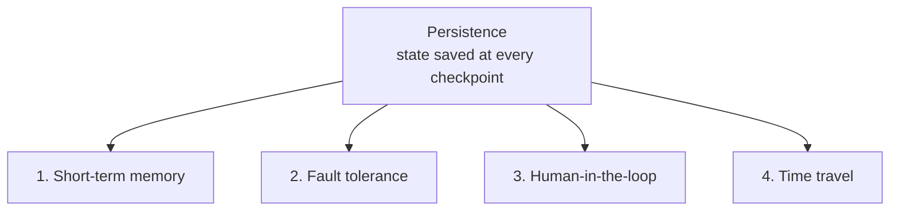

---

### 1. Short-Term Memory

When you use a tool like ChatGPT you get two options: **start a new conversation**, or **resume a past one**. Resuming means seeing everything you said before and continuing from exactly where you stopped.

That's only possible if the messages were stored somewhere. In LangGraph, **persistence is the only way to implement short-term memory.**

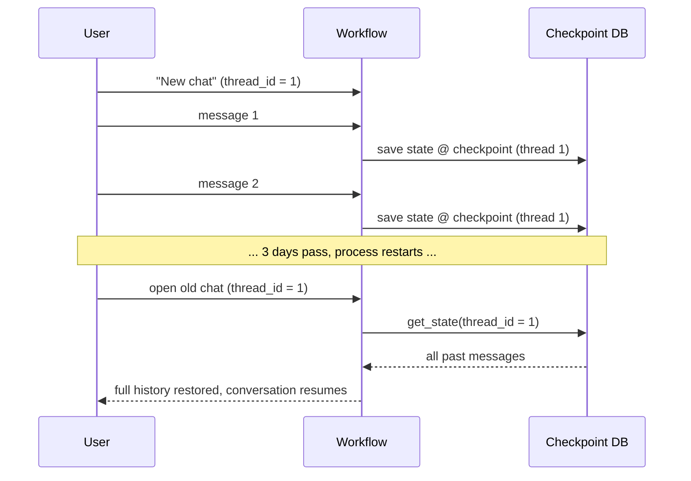

Practically: put your messages list in the state, attach a checkpointer, and give each conversation its own `thread_id`.

---

### 2. Fault Tolerance

A long-running workflow crashes halfway — a server dies, an API times out. Without persistence you re-run everything from the top. With persistence you know:

- **where** the crash happened,
- **what** the state was at that point,
- **which node** was supposed to run next.

So you resume at the exact point of failure.

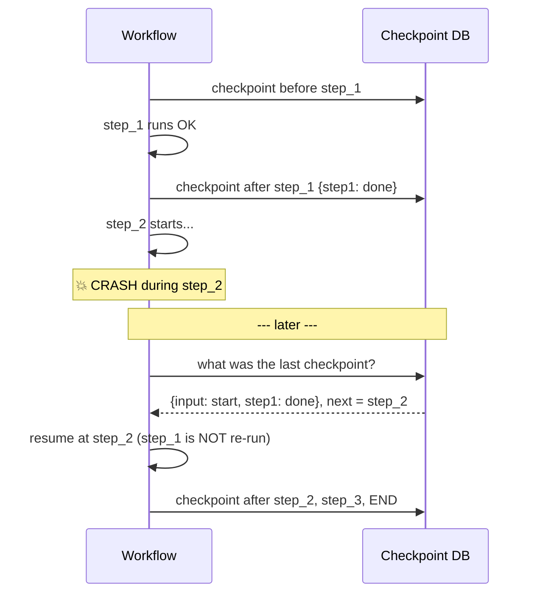

#### Worked example — simulating a crash

```python
import time
from typing import TypedDict
from langgraph.graph import StateGraph, START, END
from langgraph.checkpoint.memory import InMemorySaver


class CrashState(TypedDict):
    input: str
    step1: str
    step2: str
    step3: str


def step_1(state: CrashState):
    print("Step 1 executed")
    return {"step1": "done"}


def step_2(state: CrashState):
    print("Step 2 starting — sleeping 30s (interrupt me here!)")
    time.sleep(30)                     # <- window to simulate a crash
    print("Step 2 executed")
    return {"step2": "done"}


def step_3(state: CrashState):
    print("Step 3 executed")
    return {"step3": "done"}


graph = StateGraph(CrashState)
graph.add_node("step_1", step_1)
graph.add_node("step_2", step_2)
graph.add_node("step_3", step_3)

graph.add_edge(START, "step_1")
graph.add_edge("step_1", "step_2")
graph.add_edge("step_2", "step_3")
graph.add_edge("step_3", END)

workflow = graph.compile(checkpointer=InMemorySaver())
config = {"configurable": {"thread_id": "1"}}
```

**Run 1 — crash it:**

```python
workflow.invoke({"input": "start"}, config=config)
# Step 1 executed
# Step 2 starting — sleeping 30s...
# <-- press Ctrl+C / "Interrupt kernel" here
```

**Inspect what survived:**

```python
workflow.get_state(config).values
# {'input': 'start', 'step1': 'done'}
#            ^ step2 is absent -> the crash happened inside step_2

len(list(workflow.get_state_history(config)))
# 3   (empty state, after START, after step_1)
```

**Run 2 — resume by passing `None`:**

```python
workflow.invoke(None, config=config)   # <-- None means "resume", not "start over"
# Step 2 executed          <- notice: "Step 1 executed" does NOT print again
# Step 3 executed

workflow.get_state(config).values
# {'input': 'start', 'step1': 'done', 'step2': 'done', 'step3': 'done'}
```

| Argument to `invoke()` | Meaning |
|---|---|
| `{"input": "start"}` | Start a fresh execution with this initial state |
| `None` | **Resume** this thread from wherever it last stopped |

> 💡 The **same `thread_id`** must be used on the resume call. A different thread has no idea a crash ever happened.

---

### 3. Human-in-the-Loop (HITL)

Consider: given a topic → generate a LinkedIn post → publish it via the LinkedIn API.

You'd want a human to approve the post before it goes live.

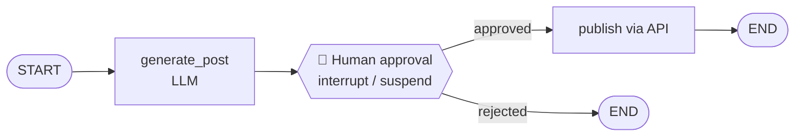

**Why this is trickier than it sounds:** the LLM writes the post in two seconds, but the human might reply in two minutes — or two hours, or two days. You obviously cannot keep the workflow alive in memory for two days waiting.

**LangGraph's solution:** at the approval point it **interrupts** — temporarily suspends — execution. The process can go away entirely. When the human's input finally arrives, the workflow **resumes at exactly the point it was interrupted**.

How does it know where to resume? **Persistence.** The state was checkpointed right before the pause.

| | Fault tolerance | Human-in-the-loop |
|---|---|---|
| Cause of the stop | External / unintended (crash, outage) | Internal / deliberate (`interrupt`) |
| Who triggers resume | You / a retry mechanism | Human input |
| Underlying mechanism | **Same** — resume from last checkpoint | **Same** — resume from last checkpoint |

HITL is essentially deliberate fault tolerance.

---

### 4. Time Travel

Time travel = **replay** your workflow's execution from any past checkpoint.

Take the completed pizza run. You can jump back to the checkpoint where `topic = "pizza"` existed but the joke hadn't been generated yet, and re-execute everything downstream from there.

**Why bother? Debugging.** In a complex workflow where something goes wrong midway, you can return to that exact checkpoint and re-run from it instead of restarting the whole pipeline.

#### Step 1 — find the checkpoint you want

Every checkpoint has its own **`checkpoint_id`**.

```python
for snap in workflow.get_state_history(config1):
    print(snap.values)
    print("  next:", snap.next)
    print("  checkpoint_id:", snap.config["configurable"]["checkpoint_id"])
```

Pick the one where `values == {'topic': 'pizza'}` and copy its id.

#### Step 2 — read state *at* that checkpoint

```python
replay_config = {
    "configurable": {
        "thread_id": "1",
        "checkpoint_id": "1f02...abc",   # <- the copied id
    }
}

workflow.get_state(replay_config).values
# {'topic': 'pizza'}      <- an INTERMEDIATE state, not the final one
```

Adding `checkpoint_id` to the config is what turns "give me the latest state" into "give me the state at this specific moment."

#### Step 3 — replay from there

```python
workflow.invoke(None, config=replay_config)
# {'topic': 'pizza', 'joke': '<a DIFFERENT joke>', 'explanation': '<different>'}
```

`None` again means resume/replay. Because LLMs are **probabilistic**, the regenerated joke will differ from the original. That's expected, not a bug.

The history now has **6** snapshots — the original 4, plus 2 from the replay branch.

#### Step 4 — edit the past with `update_state`

You can go further: change a state value at a checkpoint and replay with the new value.

```python
new_config = workflow.update_state(
    replay_config,                # the checkpoint where topic == "pizza"
    {"topic": "samosa"},          # the override
)
# update_state RETURNS a config containing a BRAND-NEW checkpoint_id
```

This creates a **new branch** with `topic = "samosa"`. History grows to **7** snapshots.

#### Step 5 — replay from the *new* branch

```python
workflow.invoke(None, config=new_config)   # <- use the NEW config/checkpoint_id
# {'topic': 'samosa', 'joke': '<samosa joke>', 'explanation': '<samosa explanation>'}
```

⚠️ **This is the classic mistake** (and one made live in the source video): after `update_state`, re-running with the **old** `checkpoint_id` replays from the *pizza* checkpoint and you get a pizza joke again, wondering why your edit did nothing. You must invoke from the checkpoint `update_state` created.

#### The resulting checkpoint tree

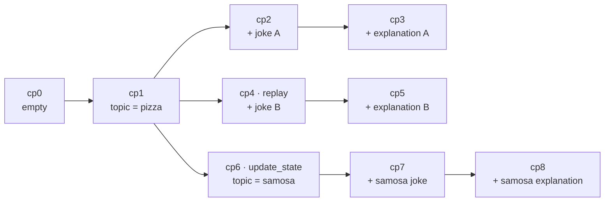

Persistence turns your execution history into a **branching tree**, not a straight line — much like commits in version control.

---

## Reference Tables

### The three config keys

| Key | Required? | What it identifies | Analogy |
|---|---|---|---|
| `thread_id` | ✅ Always, when a checkpointer is attached | One **execution / conversation** | A branch or a chat |
| `checkpoint_id` | Optional | One **moment** inside that thread | A specific commit |
| `checkpoint_ns` | Rarely set manually | Namespace, used for subgraphs | A sub-folder |

### The main API surface

| Call | Returns | Use it to |
|---|---|---|
| `graph.compile(checkpointer=...)` | Compiled workflow | Turn persistence **on** |
| `workflow.invoke(input, config)` | Final state | Run fresh |
| `workflow.invoke(None, config)` | Final state | **Resume / replay** |
| `workflow.get_state(config)` | One `StateSnapshot` | Latest state — or state at a `checkpoint_id` |
| `workflow.get_state_history(config)` | Iterator of snapshots, newest → oldest | See **all** intermediate states |
| `workflow.update_state(config, values)` | New config with new `checkpoint_id` | Edit the past, fork a branch |

### `get_state` vs `get_state_history`

| | `get_state` | `get_state_history` |
|---|---|---|
| Returns | A single snapshot | All snapshots for the thread |
| Default target | The **latest** checkpoint | Every checkpoint |
| Ordering | n/a | **Newest first**, oldest last |
| Typical use | "What's the answer?" | Debugging, time travel, auditing |

### Snapshot anatomy

| Field | Contains |
|---|---|
| `.values` | The state dict at that checkpoint |
| `.next` | Tuple of node(s) about to run. Empty `()` = finished |
| `.config` | Includes the `checkpoint_id` you need for time travel |
| `.metadata` | Step number, source, writes |

---

## Common Pitfalls / Gotchas

1. **Forgetting `checkpointer=` at compile time.** Creating an `InMemorySaver()` object does nothing on its own. It must be passed into `graph.compile(checkpointer=checkpointer)`.

2. **Forgetting `thread_id`.** Once a checkpointer is attached, `invoke()` without a `config` containing `thread_id` raises an error. It is no longer optional.

3. **Reusing a `thread_id` when you wanted a fresh start.** Same thread = same conversation = old state gets loaded and continued. New conversation → new thread_id.

4. **Shipping `InMemorySaver` to production.** It's RAM-only. Process restarts and everything vanishes. Use Postgres/Redis/SQLite in anything real.

5. **Passing an initial state instead of `None` when resuming.** `invoke(None, config)` resumes; `invoke({...}, config)` starts a new run and writes new input into the thread.

6. **Using the old `checkpoint_id` after `update_state`.** `update_state` returns a **new** config with a **new** checkpoint_id. Invoke with that returned config, or your edit is silently ignored and you replay the original branch.

7. **Expecting a replay to reproduce identical output.** LLMs are probabilistic. Same checkpoint, same prompt, different joke. Time travel replays the *path*, not the *result*.

8. **Reading `get_state_history` as oldest-first.** It's newest-first. The empty state with `next = ('__start__',)` is at the **bottom** of the list.

9. **Confusing `thread_id` with `checkpoint_id`.** `thread_id` = *which run*. `checkpoint_id` = *which moment inside that run*.

10. **Forgetting reducers change checkpoint contents.** Without `Annotated[list, add]`, each node **overwrites** the key instead of appending — so your saved intermediate states will look wrong (`[2]` instead of `[1, 2]`).

11. **Assuming persistence gives long-term, cross-conversation memory.** Out of the box it gives **short-term memory scoped to a thread**. Sharing knowledge *across* threads is a separate concern (the store / long-term memory layer).

12. **Counting checkpoints per node instead of per superstep.** Parallel nodes collapse into one superstep → one checkpoint, not one per node.

---

## Key Concepts Worth Remembering

- **Persistence = save and restore the state of a workflow over time.**
- **Default LangGraph behavior:** state is erased from RAM once execution ends. Persistence overrides that.
- **It stores intermediate states, not just the final one.** This single fact is what unlocks everything else.
- **Persistence is implemented via a checkpointer**, passed into `graph.compile(checkpointer=...)`.
- **One checkpoint per superstep.** Parallel nodes = one superstep = one checkpoint.
- **`thread_id` = one execution/conversation.** All state is stored against it. Required once a checkpointer exists.
- **`checkpoint_id` = one specific moment** inside a thread. Add it to the config to read or replay that moment.
- **`invoke(None, config)` means resume**, not start over.
- **`get_state` → latest snapshot. `get_state_history` → all snapshots, newest first.**
- **`.next` tells you which node was about to run.** Empty tuple = execution finished.
- **`update_state` forks a new branch and returns a new `checkpoint_id`** — always invoke from that new one.
- **InMemorySaver is for demos; Postgres/Redis for production.** The concept is identical either way.
- **Four benefits, one foundation:** short-term memory, fault tolerance, human-in-the-loop, time travel — all of them are persistence in different clothing.
- **HITL is deliberate fault tolerance:** one is caused by an external failure, the other by an intentional interrupt, but both resume from the last checkpoint.

---

## Summary

Persistence is the mechanism that lets a LangGraph workflow's state outlive its execution. A checkpointer slices the graph into checkpoints — one per superstep — and writes the state to a store at each one, so you end up with a complete, replayable trace rather than a single final answer. Each execution is tagged with a `thread_id` so different runs and different conversations stay cleanly separated, and each individual snapshot carries a `checkpoint_id` you can address directly.

Turning it on is trivial — build a checkpointer, pass it to `compile()`, pass a `thread_id` in your config — but what it unlocks is not. Short-term memory (resume an old chat), fault tolerance (restart from the crash point, not the beginning), human-in-the-loop (suspend indefinitely and resume when a person replies), and time travel (jump back to any checkpoint, optionally edit the state, and replay a new branch) are all just persistence viewed from four angles.

That's why it's a foundational topic: nearly every advanced LangGraph feature you'll learn next is built on the assumption that state has been saved. Get the mental model — *state at every checkpoint, addressed by thread and checkpoint id* — and the rest follows.
