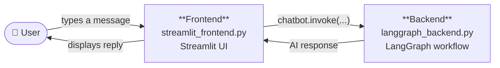
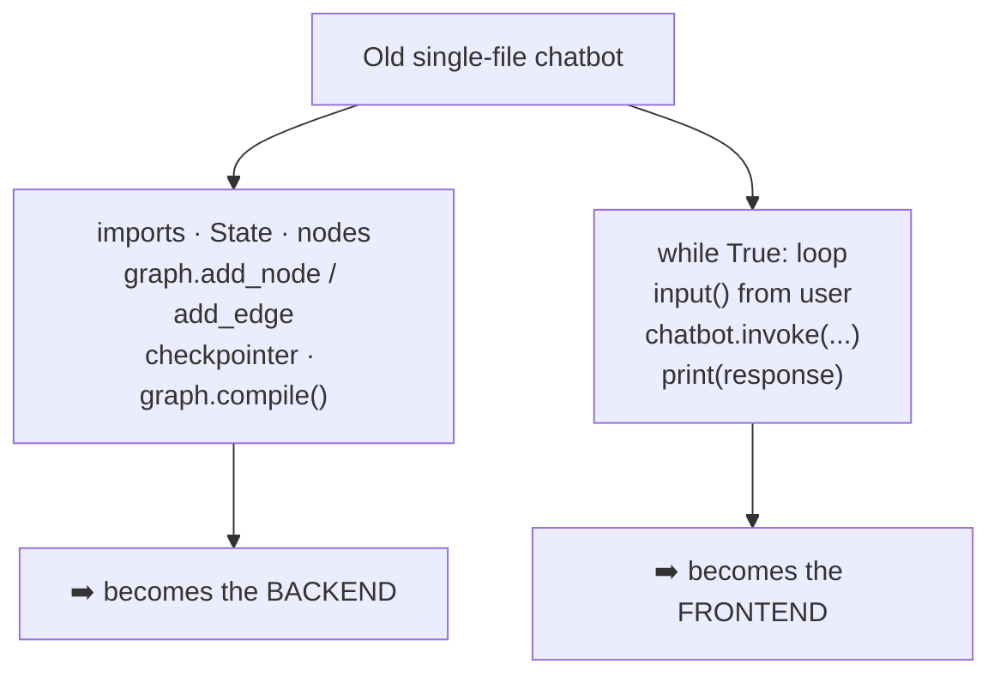
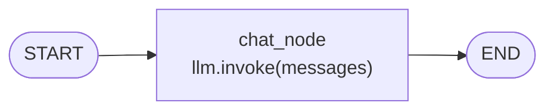
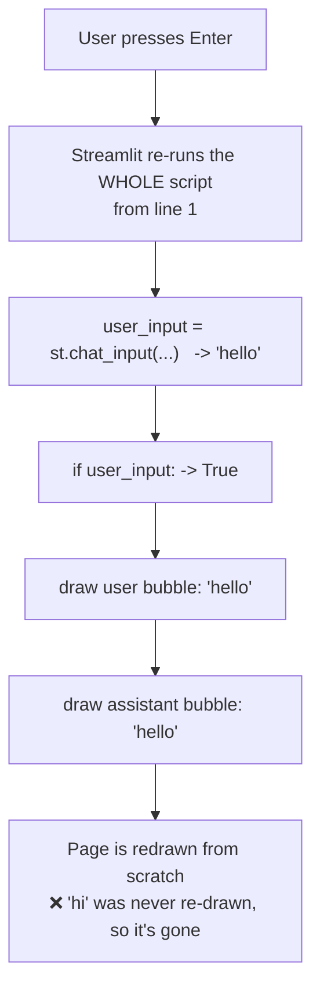
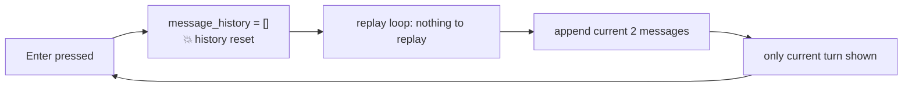
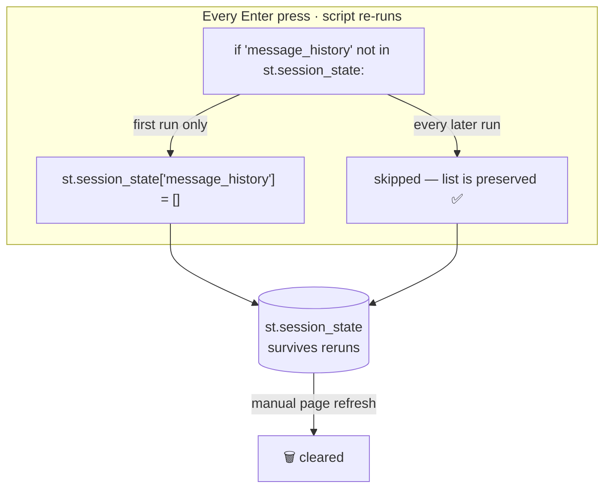
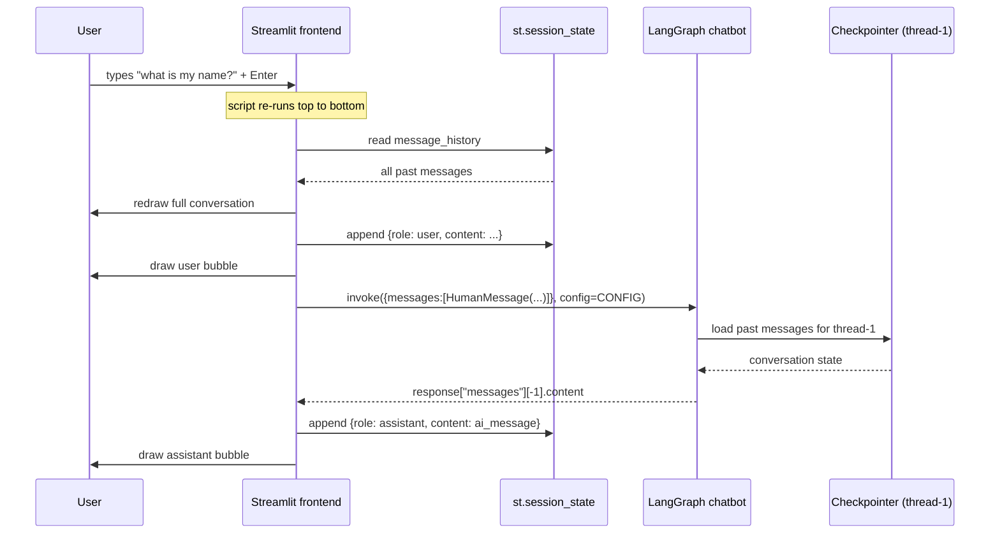
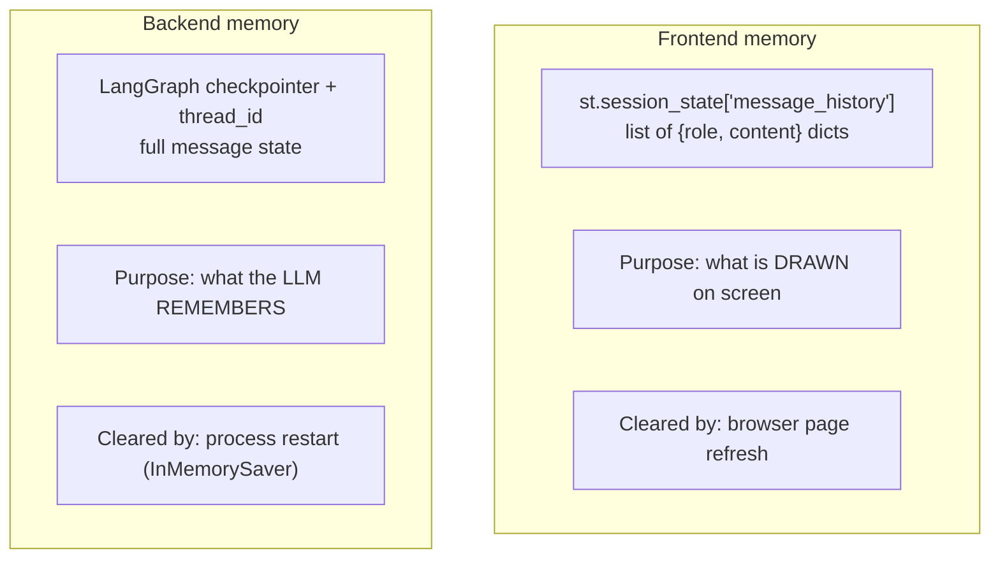

# Giving a LangGraph Chatbot a UI with Streamlit

> **One-line summary:** Split your chatbot into a **LangGraph backend** and a **Streamlit frontend**, use `st.chat_message` + `st.chat_input` to draw the interface, and use `st.session_state` to survive Streamlit's rerun-on-every-keystroke behaviour — that's the entire recipe for a working chat UI.

---

## Overview

In an earlier build, the LangGraph chatbot worked correctly and even had **short-term memory** — it remembered past messages via a checkpointer. But it had one large flaw: **no user interface**. The only way to talk to it was inside the same Jupyter notebook that defined it. Not something you can hand to another person.

This topic fixes that. The goal is a real **web interface** — a page with a message list and an input box at the bottom, where a user types, sees their own message appear, and gets a reply from the assistant right below it. Memory still works: tell it your name early, ask "what is my name?" later, and it answers correctly.

The tool used is **Streamlit**, a Python library for building websites without writing HTML/CSS/JS. It's not the only option, but it is the fastest path from "working LangGraph script" to "thing with a UI."

The good news up front: **the backend needs almost no work.** Nearly all of it is already written. The effort goes into the frontend, and the frontend has exactly three ideas in it — two components and one gotcha.

**Prerequisites**
- Streamlit fundamentals (genuinely small — a 15–20 minute intro video is enough)
- LangGraph fundamentals (state, graphs, checkpointers, `thread_id`)

---

## 1. The Architecture: Split the Chatbot in Two

The single most important structural decision: your chatbot now has **two components**, living in **two separate files**.



| | Backend | Frontend |
|---|---|---|
| File | `langgraph_backend.py` | `streamlit_frontend.py` |
| Library | LangGraph + LangChain | Streamlit |
| Responsibility | Define state, nodes, edges, checkpointer; compile the graph | Draw the UI, collect input, display messages |
| Talks to | The LLM | The user |
| How much new code? | **Almost none** — reused as-is | **All of it** — this is the work |

### Mapping the old single-file code onto the split

If you look at the original notebook chatbot, the split is mechanical:



Everything that **builds the workflow** → backend.
Everything that **loops, asks the user for input, invokes, and prints** → frontend. The `while True` + `input()` + `print()` trio is exactly what Streamlit replaces.

---

## 2. Project Setup

```
chatbot-ui/
├── langgraph_backend.py      # LangGraph workflow (mostly pre-written)
├── streamlit_frontend.py     # Streamlit UI (written in this lesson)
├── .env                      # OPENAI_API_KEY=sk-...
└── venv/                     # virtual environment
```

Install into the virtual environment:

```bash
pip install langchain langchain-openai langgraph streamlit python-dotenv
```

Run the app (note: **not** `python file.py`):

```bash
streamlit run streamlit_frontend.py
```

---

## 3. The Backend — Reused As-Is

This is the same code as the earlier chatbot build. Nothing here is new.

```python
# langgraph_backend.py
from typing import TypedDict, Annotated

from langgraph.graph import StateGraph, START, END
from langgraph.graph.message import add_messages
from langgraph.checkpoint.memory import InMemorySaver
from langchain_core.messages import BaseMessage
from langchain_openai import ChatOpenAI
from dotenv import load_dotenv

load_dotenv()

llm = ChatOpenAI()


# ---------- State ----------
class ChatState(TypedDict):
    # add_messages is the reducer: new messages are APPENDED, not overwritten
    messages: Annotated[list[BaseMessage], add_messages]


# ---------- Node ----------
def chat_node(state: ChatState):
    response = llm.invoke(state["messages"])
    return {"messages": [response]}


# ---------- Graph ----------
graph = StateGraph(ChatState)
graph.add_node("chat_node", chat_node)
graph.add_edge(START, "chat_node")
graph.add_edge("chat_node", END)

# persistence -> this is what gives the bot its short-term memory
checkpointer = InMemorySaver()

chatbot = graph.compile(checkpointer=checkpointer)
```



The only object the frontend needs from this file is **`chatbot`**.

---

## 4. Streamlit's Two Chat Components

Before writing any UI code, identify what the interface is actually *made of*. Looking at the target UI, there are exactly **two** components:

```
┌──────────────────────────────────────┐
│ 👤 user      hi                       │  ◄─┐
├──────────────────────────────────────┤    │
│ 🤖 assistant  Hello! How can I help?  │  ◄─┤  st.chat_message
├──────────────────────────────────────┤    │
│ 👤 user      my name is Nitish        │  ◄─┘
├──────────────────────────────────────┤
│  Type here...                     ⏎  │  ◄─── st.chat_input
└──────────────────────────────────────┘
```

### `st.chat_message` — the message bubble

```python
import streamlit as st

with st.chat_message("user"):
    st.text("hi")

with st.chat_message("assistant"):
    st.text("How can I help you?")
```

- The single required argument is the **role** — who sent this message.
- The role is what selects the **avatar icon**, so `user` and `assistant` render differently and you can tell at a glance who said what.
- Icons can be overridden with the optional `avatar` parameter (not needed here).

### `st.chat_input` — the input box

```python
user_input = st.chat_input("Type here")
```

- The string is a **placeholder** shown to the user.
- It returns whatever the user typed **when they press Enter**, otherwise `None`.
- Streamlit pins this component to the **bottom of the page**, regardless of where in the script you call it.

### Making the input do something

```python
user_input = st.chat_input("Type here")

if user_input:                       # None on first load, truthy after Enter
    with st.chat_message("user"):
        st.text(user_input)
```

| Component | Purpose | Key argument | Returns |
|---|---|---|---|
| `st.chat_message(role)` | Render one message bubble | `role`: `"user"` / `"assistant"` | A context manager (`with` block) |
| `st.chat_input(placeholder)` | Bottom input bar | placeholder text | The typed string, or `None` |

---

## 5. The Rerun Problem — Why Your Messages Keep Vanishing

Build a naive "copycat" bot (the assistant just echoes the user) and you'll hit the central gotcha immediately.

```python
user_input = st.chat_input("Type here")

if user_input:
    with st.chat_message("user"):
        st.text(user_input)

    with st.chat_message("assistant"):
        st.text(user_input)          # dumb echo
```

Type `hi` → you see two `hi` bubbles. 
Type `hello` → the `hi` bubbles **disappear** and only `hello` remains.

### Why

**Streamlit re-executes the entire script, top to bottom, every single time the user presses Enter.**



The script only ever knows about the **current** input. There is no memory of previous turns, because nothing is storing them.

### Attempt #1 — a plain Python list (this also fails)

The obvious fix: keep a conversation history and replay it at the top.

```python
message_history = []        # ⚠️ this line is the bug

for message in message_history:
    with st.chat_message(message["role"]):
        st.text(message["content"])

user_input = st.chat_input("Type here")

if user_input:
    message_history.append({"role": "user", "content": user_input})
    with st.chat_message("user"):
        st.text(user_input)

    message_history.append({"role": "assistant", "content": user_input})
    with st.chat_message("assistant"):
        st.text(user_input)
```

Still broken. **Because the script reruns top-to-bottom, `message_history = []` runs again too** — wiping the list on every single Enter press before anything can be replayed.



What we need is a container that is **not** re-initialised on rerun.

---

## 6. `st.session_state` — The Dictionary That Survives Reruns

Streamlit provides exactly that: **`st.session_state`**.

- It **is** a dictionary — nothing exotic.
- Its special property: **its contents are not erased when the script reruns.**
- It is only cleared when the user **manually refreshes the page** in the browser.

So values **accumulate** across reruns instead of resetting.



### The guard pattern

```python
if "message_history" not in st.session_state:
    st.session_state["message_history"] = []
```

Read this literally: `st.session_state` is a dict; we're adding a key called `message_history` whose value is a list. The `if` makes the initialisation happen **once**, on the very first run.

### The history data shape

Each message is a small dictionary; all of them live in a list:

```python
[
    {"role": "user",      "content": "hi"},
    {"role": "assistant", "content": "Hello! How can I assist you today?"},
    {"role": "user",      "content": "my name is Nitish"},
]
```

Two keys only: **`role`** (who spoke) and **`content`** (what they said). This shape is deliberate — `role` feeds straight into `st.chat_message(...)` and `content` into `st.text(...)`.

### The working copycat bot

```python
import streamlit as st

# 1. initialise once
if "message_history" not in st.session_state:
    st.session_state["message_history"] = []

# 2. replay the whole conversation on every rerun
for message in st.session_state["message_history"]:
    with st.chat_message(message["role"]):
        st.text(message["content"])

# 3. take new input
user_input = st.chat_input("Type here")

if user_input:
    # user turn: store, then show
    st.session_state["message_history"].append({"role": "user", "content": user_input})
    with st.chat_message("user"):
        st.text(user_input)

    # assistant turn: store, then show
    st.session_state["message_history"].append({"role": "assistant", "content": user_input})
    with st.chat_message("assistant"):
        st.text(user_input)
```

**The order of operations on every rerun:**

```
1. replay entire history  ->  old messages redrawn
2. current user message   ->  appended + drawn
3. current assistant msg  ->  appended + drawn
```

That's why nothing disappears any more. The **rule of thumb: append to history *before* displaying.**

---

## 7. Wiring Streamlit to LangGraph

Here's the pleasant surprise — moving from the dumb echo bot to a real AI bot touches **one block of code**.

| Section of the frontend | Needs changes? |
|---|---|
| `session_state` initialisation | ❌ No |
| History replay loop | ❌ No |
| `st.chat_input` / `if user_input:` | ❌ No |
| Appending + displaying the **user** message | ❌ No |
| Appending + displaying the **assistant** message | ✅ **Yes — this is the only edit** |

Currently the assistant message is just `user_input`. In reality we must: send the user's text to the LLM, get a response back, extract the AI message, and display *that*.

### Step 1 — import the backend

```python
from langgraph_backend import chatbot
from langchain_core.messages import HumanMessage
```

`chatbot.invoke(...)` lives in the backend file, so import the compiled object directly.

### Step 2 — define the config (the `thread_id`)

Because the backend compiled with a **checkpointer**, every `invoke` **must** carry a `thread_id`.

```python
CONFIG = {"configurable": {"thread_id": "thread-1"}}
```

### Step 3 — invoke and extract

```python
response = chatbot.invoke(
    {"messages": [HumanMessage(content=user_input)]},
    config=CONFIG,
)

ai_message = response["messages"][-1].content    # last message = the AI's reply
```

### Step 4 — store and display `ai_message` instead of `user_input`

```python
st.session_state["message_history"].append({"role": "assistant", "content": ai_message})
with st.chat_message("assistant"):
    st.text(ai_message)
```

### The full turn, as a sequence



---

## 8. Two Memories, Not One

This is the conceptual point most easily missed, and it explains a lot of confusing behaviour.

There are **two independent memory systems** running side by side:



| | `st.session_state` | LangGraph checkpointer |
|---|---|---|
| Lives in | The Streamlit frontend | The LangGraph backend |
| Stores | `{"role", "content"}` dicts for rendering | `HumanMessage` / `AIMessage` objects |
| Used for | **Displaying** the conversation | **Giving the LLM context** |
| Keyed by | The browser session | `thread_id` |
| Wiped when | You refresh the page | The Python process restarts (with `InMemorySaver`) |

**Observable consequence:** refresh the browser and the screen goes blank — but ask "what is my name?" and the bot still knows. The display history was cleared; the LangGraph thread was not. They are not the same thing, and neither one is redundant.

---

## Comparison Tables

### Building the UI: options

| Approach | Speed to build | Control over look | Good for |
|---|---|---|---|
| **Streamlit** | Fastest | Limited (opinionated components) | Demos, internal tools, learning — used here |
| Gradio / Chainlit | Fast | Limited | ML demos, chat-first apps |
| FastAPI + a JS frontend | Slow | Total | Production products |

The stated reason for choosing Streamlit: it was the **best and fastest option for a demonstration**. Other options exist.

### Rerun vs Refresh

| | Script rerun | Page refresh |
|---|---|---|
| Triggered by | Pressing Enter / any widget interaction | Browser reload button |
| Script re-executes? | ✅ Yes, top to bottom | ✅ Yes |
| Plain variables reset? | ✅ Yes | ✅ Yes |
| `st.session_state` reset? | ❌ **No** | ✅ Yes |

### `st.text` vs alternatives for message content

| Call | Renders markdown? | Notes |
|---|---|---|
| `st.text(...)` | ❌ No | Plain text — used throughout this build |
| `st.write(...)` / `st.markdown(...)` | ✅ Yes | Better for LLM output, which is usually markdown (lists, bold, code) |

---

## Worked Examples — The Progressive Build

### Stage 1 — static message bubbles

```python
import streamlit as st

with st.chat_message("user"):
    st.text("hi")

with st.chat_message("assistant"):
    st.text("How can I help you?")

with st.chat_message("user"):
    st.text("my name is Nitish")
```

```bash
streamlit run streamlit_frontend.py
```
→ Three hardcoded bubbles with correct avatars. Proves the component works.

---

### Stage 2 — add an input box

```python
user_input = st.chat_input("Type here")

if user_input:
    with st.chat_message("user"):
        st.text(user_input)
```
→ Typing updates the bubble. But each new message **replaces** the last.

---

### Stage 3 — copycat bot (broken)

```python
user_input = st.chat_input("Type here")

if user_input:
    with st.chat_message("user"):
        st.text(user_input)
    with st.chat_message("assistant"):
        st.text(user_input)
```
→ Two identical bubbles per turn, but **history is destroyed on every Enter**.

---

### Stage 4 — copycat bot with `session_state` (working)

See §6 above. History now accumulates correctly. This is the point where the UI is genuinely finished — only the *content* of the assistant reply is still fake.

---

### Stage 5 — the real thing

**`streamlit_frontend.py` (final)**

```python
import streamlit as st
from langgraph_backend import chatbot
from langchain_core.messages import HumanMessage

CONFIG = {"configurable": {"thread_id": "thread-1"}}

# ---------- 1. persistent display history ----------
if "message_history" not in st.session_state:
    st.session_state["message_history"] = []

# ---------- 2. replay the conversation ----------
for message in st.session_state["message_history"]:
    with st.chat_message(message["role"]):
        st.text(message["content"])

# ---------- 3. new user input ----------
user_input = st.chat_input("Type here")

if user_input:
    # --- user turn ---
    st.session_state["message_history"].append(
        {"role": "user", "content": user_input}
    )
    with st.chat_message("user"):
        st.text(user_input)

    # --- assistant turn ---
    response = chatbot.invoke(
        {"messages": [HumanMessage(content=user_input)]},
        config=CONFIG,
    )
    ai_message = response["messages"][-1].content

    st.session_state["message_history"].append(
        {"role": "assistant", "content": ai_message}
    )
    with st.chat_message("assistant"):
        st.text(ai_message)
```

**Test transcript that proves memory works:**

```
user      : hello
assistant : Hello! How can I assist you?
user      : my name is Nitish
assistant : Nice to meet you, Nitish...
user      : what is the capital of Kerala
assistant : Thiruvananthapuram
user      : what is my name?
assistant : Your name is Nitish.       ← short-term memory via the checkpointer
```

---

## Common Pitfalls / Gotchas

1. **Initialising history with a plain variable.** `message_history = []` at the top of the script is re-executed on every rerun and silently wipes everything. Always use the `if "key" not in st.session_state:` guard.

2. **Forgetting that the whole script reruns.** Any logic you write at module level runs again on *every* keypress-Enter. Expensive setup (model clients, DB connections) belongs behind a `session_state` check or `@st.cache_resource`.

3. **Invoking with a checkpointer but no `thread_id`.** This is the exact bug hit live in the build: the backend compiled with `InMemorySaver`, but `chatbot.invoke({...})` was called without a config → error. Once a checkpointer exists, `config={"configurable": {"thread_id": ...}}` is **mandatory**.

4. **Displaying before appending.** If you draw the bubble first and append second, the message is missing from history on the *next* rerun and flickers out. Order: **append → display.**

5. **Forgetting to append the assistant message too.** Easy to append the user's message and not the AI's. Result: user messages persist, AI replies vanish on the next turn.

6. **Sending the whole history into `invoke`.** You only need to send the **new** `HumanMessage`. LangGraph's checkpointer + `add_messages` reducer already holds the prior conversation for that `thread_id`. Re-sending everything duplicates messages in the state.

7. **Hardcoding a single `thread_id`.** `"thread-1"` is fine for a demo, but every visitor to a deployed app then shares one conversation. Real apps generate a unique thread per session and store it in `session_state`.

8. **Expecting `session_state` to survive a page refresh.** It doesn't. It survives *reruns*, not *reloads*. And `InMemorySaver` doesn't survive a process restart — swap in a Postgres/SQLite checkpointer for anything durable.

9. **Running with `python streamlit_frontend.py`.** Streamlit apps must be launched with `streamlit run <file>`.

10. **Confusing the two histories.** `session_state["message_history"]` is for *rendering*; the checkpointer state is for the *LLM*. They can and do go out of sync (refresh the page to see it).

11. **`st.text` swallows formatting.** LLM output is usually markdown. `st.text` shows the raw asterisks and backticks; `st.write` / `st.markdown` renders them.

12. **No streaming means the UI blocks.** `chatbot.invoke(...)` is synchronous, so the page sits still until the full reply arrives. Fine for learning, noticeable on long answers.

---

## Key Concepts Worth Remembering

- **Split the app in two: `langgraph_backend.py` (workflow) and `streamlit_frontend.py` (UI).** The old `while True` + `input()` + `print()` loop *is* the frontend.
- **The backend barely changes.** All the effort is frontend.
- **Two Streamlit components build the whole chat UI:** `st.chat_message(role)` for bubbles, `st.chat_input(placeholder)` for the input bar.
- **The `role` argument picks the avatar** — `"user"` vs `"assistant"`.
- **Streamlit re-runs the entire script, top to bottom, on every Enter.** Internalise this; every other quirk follows from it.
- **Plain variables reset on rerun. `st.session_state` does not.** It resets only on a manual page refresh.
- **The guard pattern:** `if "message_history" not in st.session_state: st.session_state["message_history"] = []`
- **Message shape is two keys:** `{"role": ..., "content": ...}` — one feeds `chat_message`, the other feeds `st.text`.
- **Order on every rerun:** replay history → append + show user message → append + show assistant message.
- **Append before you display.**
- **Only one block changes when going from echo bot to AI bot** — the assistant message block.
- **`response["messages"][-1].content` is the AI's reply.**
- **A checkpointer makes `thread_id` mandatory on every `invoke`.**
- **Two memories:** `session_state` = what's on screen; the checkpointer = what the model remembers.

---

## Summary

A LangGraph chatbot becomes a usable product the moment it gets a frontend, and the cleanest way to add one is to split the project into a backend file that builds and compiles the graph and a frontend file that draws the interface. Streamlit reduces that interface to two components — `st.chat_message` for the bubbles and `st.chat_input` for the input bar — so the visual work is genuinely small.

The one real obstacle is Streamlit's execution model: the entire script re-runs from the top on every user submission, which destroys any conversation history stored in an ordinary variable. `st.session_state` is the purpose-built escape hatch, a dictionary that persists across reruns and clears only on a page refresh. Guard its initialisation, replay the stored history at the top of the script, and append each message before rendering it.

Connecting the two halves then takes one import and one block of code: send the user's text as a `HumanMessage` to `chatbot.invoke`, pass a `config` carrying a `thread_id` (mandatory once a checkpointer is attached), and pull the reply out of `response["messages"][-1].content`. Keep in mind that you now maintain two distinct memories — the session-state list that decides what appears on screen, and the LangGraph checkpointer that decides what the model actually knows.
