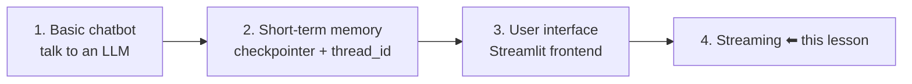
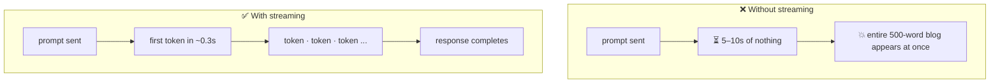
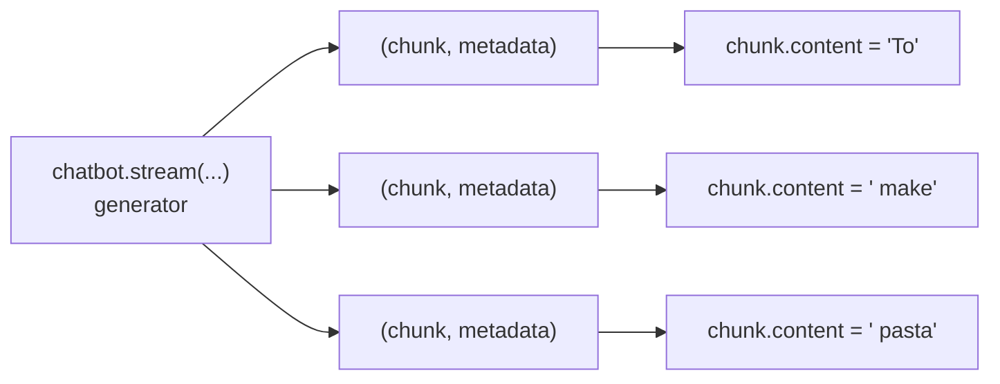
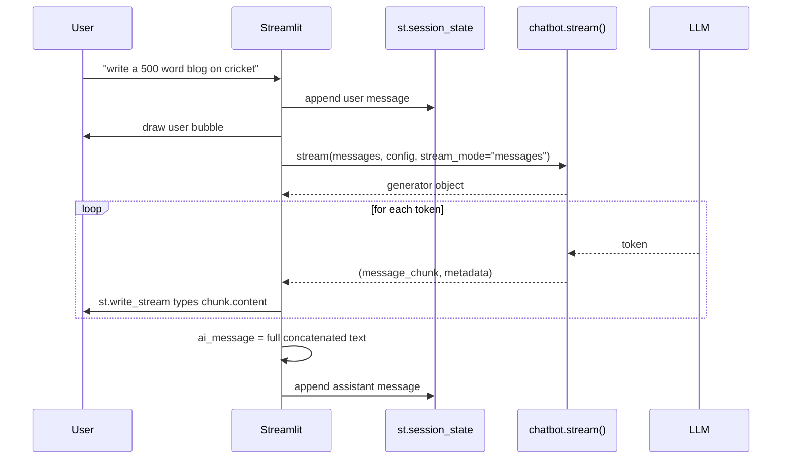

# Streaming in LangGraph (with a Streamlit UI)

> **One-line summary:** Swap `chatbot.invoke(...)` for `chatbot.stream(..., stream_mode="messages")` to get a generator of token chunks, then hand that generator to `st.write_stream()` — that single change turns a blank-screen-then-wall-of-text chatbot into a ChatGPT-style typewriter experience.

---

## Overview

This is the fourth feature added to the same chatbot. The progression so far:



**The problem being solved.** Ask the current chatbot for something long — *"write a 500-word blog on cricket"* — and the screen sits completely blank for several seconds. Then, all at once, the entire blog appears. The LLM generated the whole response first, and only then did it reach the UI.

That's bad for two reasons:

1. **The user waits with no feedback** — 5, 10 seconds depending on output length.
2. **A wall of text dumped at once isn't readable.**

**The fix.** ChatGPT doesn't behave that way: the response types itself out character by character. That's **streaming**, and adding it is a genuinely small code change with an outsized effect on user experience.

---

## 1. What Streaming Is

> **In LLMs, streaming means the model starts sending tokens as soon as they are generated, instead of waiting for the entire response to be ready before returning it.**

You send a prompt — say *"what is the recipe to make pasta?"* — and there are two ways the response can come back:

| | **Non-streaming (`invoke`)** | **Streaming (`stream`)** |
|---|---|---|
| What happens | LLM thinks, generates the **whole** answer, then hands it over in one piece | LLM hands over each token **as it is generated** |
| What the user sees | Blank screen → sudden full response | Text appearing word by word, typewriter-style |
| Perceived speed | Slow | Immediate |
| Readability of long output | Poor | Good |



Same total generation time. Completely different experience.

---

## 2. Why Streaming Matters

Five distinct reasons, each worth remembering separately.

### 2.1 Faster *perceived* response time

Ask for an essay and the LLM may take 5–10 seconds. Without streaming, that's 5–10 seconds of nothing on screen.

You and I understand the model is working. But picture a **non-technical user** — someone not comfortable with tech products. To them the app looks **frozen or broken**, and they may simply close it. That's **drop-off**, and it's expensive. Streaming shows output immediately, so it's obvious everything is working.

### 2.2 It mimics human conversation

Streaming **builds trust, feels alive, and keeps the user engaged.** Talking to ChatGPT feels like talking to another person partly *because* of this effect — at every moment you're leaning in, wondering what comes next.

### 2.3 It's essential for multimodal / voice UIs

Consider an Alexa-style device without streaming. You ask *"give me the recipe to cook pasta"* — and the device stays silent while the full response generates, then starts speaking 10 seconds later. There's no **seamlessness** in the conversation. It feels like talking to someone over a phone line with bad signal.

### 2.4 Much better for long output such as code

Ask for the code for a basic website. Dumped all at once, you can't tell where anything begins or what's happening where. Printed line by line, you follow along: *this starts here, the next line does this, then this.* The step-by-step reveal is itself a readability aid.

### 2.5 You can interrupt — and interrupting saves money

If you don't like where the response is heading, you can **stop it mid-way**. The remaining tokens are never generated. Since every LLM provider charges by **token usage**, fewer tokens means **less money spent**. A stop button is only possible when output arrives incrementally.

### Bonus: streaming isn't only for LLM text

Streaming is also how you push **progress updates**. Imagine telling an AI agent *"book me a movie ticket."* Without updates, you stare at nothing for a minute and then get *"done!"* — a minute of uncertainty and mild dread.

With streaming, the agent narrates itself:

```
▸ opened BookMyShow
▸ selected the movie
▸ selected seats
▸ selected payment mode
▸ making payment
✓ ticket booked
```

This becomes important later when building agentic applications.

---

## 3. Python Generators — The Prerequisite

`stream()` returns a **generator**, so the concept matters.

> **In Python, a generator is a special type of iterator that lets you generate values on the fly, one at a time, using the `yield` keyword instead of `return`.**

```python
def count_up_to(n):
    i = 1
    while i <= n:
        yield i          # yield, not return
        i += 1

gen = count_up_to(3)
print(type(gen))         # <class 'generator'>

for value in gen:        # values produced one at a time
    print(value)         # 1, 2, 3
```

| | Normal function | Generator function |
|---|---|---|
| Keyword | `return` | `yield` |
| Returns | One finished value | A generator object |
| Values produced | All at once | One at a time, on demand |
| Memory | Holds the whole result | Holds one item at a time |
| Consumable more than once? | n/a | ❌ **No** — exhausted after one pass |

Because a generator is an iterator, you consume it by **looping over it**. That's exactly what we'll do with the token stream.

---

## 4. `invoke` → `stream`: The Only Backend Change

Per LangGraph's official documentation, the single change needed is calling **`.stream()`** instead of **`.invoke()`**.

```python
# BEFORE — one shot
response = chatbot.invoke(
    {"messages": [HumanMessage(content="What is the recipe to make pasta?")]},
    config=config,
)

# AFTER — a generator of chunks
stream = chatbot.stream(
    {"messages": [HumanMessage(content="What is the recipe to make pasta?")]},
    config=config,
    stream_mode="messages",      # <-- the new, third argument
)

print(type(stream))   # <class 'generator'>
```

`.stream()` takes **three** things:

| Argument | What it is | Note |
|---|---|---|
| Initial state | `{"messages": [HumanMessage(content=...)]}` | Same as `invoke` |
| `config` | `{"configurable": {"thread_id": "..."}}` | Still **mandatory** — the checkpointer is still attached |
| `stream_mode` | Which kind of stream you want | New — see below |

### Stream modes

| `stream_mode` | Streams | When you'll use it |
|---|---|---|
| `"messages"` | **LLM output token by token** | ✅ Now — typewriter effect |
| `"updates"` | State changes emitted by each node | Later, agentic apps |
| `"values"` | The full state after each step | Later, agentic apps |
| `"custom"` | Whatever you emit yourself | Later, custom progress updates |

For showing an LLM's response token by token, you want **`messages`**.

### The shape of each chunk

Iterating the stream in `messages` mode yields a **two-item tuple**:

```python
for message_chunk, metadata in chatbot.stream(..., stream_mode="messages"):
    ...
```

- **`message_chunk`** — the piece of the message; the text lives in `.content`
- **`metadata`** — accompanying information about the chunk



### Printing it in the backend (a throwaway test)

```python
for message_chunk, metadata in chatbot.stream(
    {"messages": [HumanMessage(content="What is the recipe to make pasta?")]},
    config=config,
    stream_mode="messages",
):
    if message_chunk.content:                      # skip empty chunks
        print(message_chunk.content, end=" ", flush=True)
```

Run it and the output streams into the terminal. **That's the entire difference:** use `.stream()` instead of `.invoke()`, loop over the generator, print the content.

> 🔁 **Important:** this was only a test. Once verified, **revert the backend to its original state.** The backend needs **no permanent changes** — all the real work happens in the frontend.

---

## 5. Streamlit's Chat Elements

Streamlit's docs list several chat elements. Two are already familiar:

| Element | Purpose | Status |
|---|---|---|
| `st.chat_input` | Bottom input bar | ✅ already used |
| `st.chat_message(role)` | A message bubble | ✅ already used |
| `st.status` | A status container for step-by-step agent updates — *getting data, searching, found URL* | 🔜 for agentic apps |
| **`st.write_stream`** | **Writes generators and streams to the app with a typewriter effect** | ⬅ **the one we need** |

`st.write_stream` is the perfect match: hand it a generator, and it handles **the entire UI side** of streaming for you. It also **returns the fully concatenated response** once streaming finishes — which is exactly what we need to save into history.

---

## 6. Wiring It Into the Frontend

Create a new file (e.g. `streamlit_frontend_streaming.py`), paste in the previous frontend code as-is, then change **one block**: the assistant's turn.

| Frontend section | Changes? |
|---|---|
| `session_state` initialisation | ❌ No |
| History replay loop | ❌ No |
| `st.chat_input` / `if user_input:` | ❌ No |
| Appending + displaying the **user** message | ❌ No |
| **Assistant message block** | ✅ **The only edit** |

### Before

```python
    response = chatbot.invoke(
        {"messages": [HumanMessage(content=user_input)]},
        config=CONFIG,
    )
    ai_message = response["messages"][-1].content

    st.session_state["message_history"].append(
        {"role": "assistant", "content": ai_message}
    )
    with st.chat_message("assistant"):
        st.text(ai_message)
```

### After

```python
    with st.chat_message("assistant"):
        ai_message = st.write_stream(
            message_chunk.content
            for message_chunk, metadata in chatbot.stream(
                {"messages": [HumanMessage(content=user_input)]},
                config=CONFIG,
                stream_mode="messages",
            )
        )

    st.session_state["message_history"].append(
        {"role": "assistant", "content": ai_message}
    )
```

Read the inner expression carefully — it's a **generator expression**: *give me `message_chunk.content` for every `(message_chunk, metadata)` in this stream.* That produces a generator of plain strings, which is precisely what `st.write_stream` consumes.

Then note the ordering change: previously we appended to history and then displayed. Now we **stream first**, capture the return value of `st.write_stream` into `ai_message`, and **append afterwards** — because the complete text doesn't exist until streaming ends.

### The full turn



---

## 7. Complete Code

### `langgraph_backend.py` — unchanged

```python
from typing import TypedDict, Annotated

from langgraph.graph import StateGraph, START, END
from langgraph.graph.message import add_messages
from langgraph.checkpoint.memory import InMemorySaver
from langchain_core.messages import BaseMessage
from langchain_openai import ChatOpenAI
from dotenv import load_dotenv

load_dotenv()

llm = ChatOpenAI()


class ChatState(TypedDict):
    messages: Annotated[list[BaseMessage], add_messages]


def chat_node(state: ChatState):
    response = llm.invoke(state["messages"])
    return {"messages": [response]}


graph = StateGraph(ChatState)
graph.add_node("chat_node", chat_node)
graph.add_edge(START, "chat_node")
graph.add_edge("chat_node", END)

chatbot = graph.compile(checkpointer=InMemorySaver())
```

### `streamlit_frontend_streaming.py` — the streaming frontend

```python
import streamlit as st
from langgraph_backend import chatbot
from langchain_core.messages import HumanMessage

CONFIG = {"configurable": {"thread_id": "thread-1"}}

# ---------- persistent display history ----------
if "message_history" not in st.session_state:
    st.session_state["message_history"] = []

# ---------- replay the conversation ----------
for message in st.session_state["message_history"]:
    with st.chat_message(message["role"]):
        st.text(message["content"])

# ---------- new input ----------
user_input = st.chat_input("Type here")

if user_input:
    # --- user turn (unchanged) ---
    st.session_state["message_history"].append(
        {"role": "user", "content": user_input}
    )
    with st.chat_message("user"):
        st.text(user_input)

    # --- assistant turn (STREAMING) ---
    with st.chat_message("assistant"):
        ai_message = st.write_stream(
            message_chunk.content
            for message_chunk, metadata in chatbot.stream(
                {"messages": [HumanMessage(content=user_input)]},   # ⚠️ user_input!
                config=CONFIG,
                stream_mode="messages",
            )
        )

    st.session_state["message_history"].append(
        {"role": "assistant", "content": ai_message}
    )
```

---

## 8. Examples to Try

| Prompt | What to observe |
|---|---|
| `what is the recipe to make pasta` | Short output — streaming visible but brief |
| `write a 500 word blog on cricket in India` | The original problem case — now types out progressively |
| `write a 500 word blog on terrorism` | Confirms the prompt isn't hardcoded (see Pitfall #1) |
| `write the code for a basic website` | Demonstrates §2.4 — long code is far easier to follow line by line |

Old behaviour vs new, on the same 500-word prompt:

```
BEFORE:  [........ 8 seconds of blank screen ........] ██████████ ALL AT ONCE
AFTER:   C·r·i·c·k·e·t· ·i·s· ·n·o·t· ·j·u·s·t· ·a· ·s·p·o·r·t ...
         ↑ first characters within a fraction of a second
```

---

## 9. Common Pitfalls / Gotchas

1. **Hardcoding the prompt instead of `user_input`.** This exact bug happened live: the test string `"What is the recipe to make pasta"` was copied from the backend experiment into `HumanMessage(content=...)`, so *every* question — cricket, terrorism, anything — came back as a pasta recipe. The content must be **`user_input`**.

2. **Forgetting `stream_mode="messages"`.** Without it you won't get token-level LLM output; you'll get state updates in a different shape and the unpacking will break.

3. **Forgetting `config` / `thread_id`.** The checkpointer is still attached, so `.stream()` needs it just as much as `.invoke()` did.

4. **Not capturing the return value of `st.write_stream`.** It returns the complete concatenated response. Discard it and you have nothing to append to `session_state` — the reply streams beautifully, then vanishes on the next rerun.

5. **Appending to history before streaming finishes.** The full text doesn't exist yet. Stream → capture → append, in that order. (Note this *reverses* the append-then-display rule used for the user message.)

6. **Unpacking only one value from the stream.** In `messages` mode each item is `(message_chunk, metadata)`. Writing `for chunk in chatbot.stream(...)` will fail or misbehave — you must unpack both, even though `metadata` goes unused here.

7. **Not guarding against empty chunks.** Some chunks carry no text. In terminal tests, `if message_chunk.content:` avoids printing noise.

8. **Cosmetic `end=` in print tests.** The docs example uses a separator like `end="|"`; changing it to `end=" "` inserts a space between every token. `end=""` gives the cleanest terminal output. Irrelevant once you move to `st.write_stream`, which handles spacing itself.

9. **Leaving experimental code in the backend.** The `.stream()` test belongs in a scratch run. Revert `langgraph_backend.py` to its original state — the streaming logic lives entirely in the frontend.

10. **Trying to reuse a generator.** Generators are exhausted after one pass. You can't stream into the UI and then loop the same object again to build the final string — that's precisely why `st.write_stream`'s return value matters.

11. **Assuming streaming makes generation faster.** It doesn't. Total time is the same; what changes is **when the user first sees something**. The win is perceived latency and readability, not throughput.

12. **Placing `st.write_stream` outside the `with st.chat_message("assistant"):` block.** The text will render outside the bubble, without the assistant avatar.

---

## 10. Key Concepts Worth Remembering

- **Streaming = the model sends tokens as they're generated**, instead of holding the whole response until it's finished.
- **The core change is one word:** `chatbot.invoke(...)` → `chatbot.stream(...)`.
- **`.stream()` needs three things:** initial state, `config` (with `thread_id`), and `stream_mode`.
- **`stream_mode="messages"` is the one for token-by-token LLM output.** The others — `updates`, `values`, `custom` — come into play with agents.
- **`.stream()` returns a generator**, so you consume it with a loop. Generators use `yield`, produce one value at a time, and can only be consumed once.
- **Each item in `messages` mode is a tuple:** `(message_chunk, metadata)`. Text lives at `message_chunk.content`.
- **`st.write_stream(generator)` handles the whole UI side** — typewriter effect included — **and returns the complete text.**
- **The backend does not change.** Only the assistant block of the frontend does.
- **Order flips for the assistant message:** stream → capture → append. (For the user message it's still append → display.)
- **Five reasons streaming matters:** perceived speed / trust and engagement / voice and multimodal UIs / readability of long output like code / interruptibility, which saves tokens and therefore money.
- **Streaming also carries progress updates**, not just LLM text — the foundation for agent status displays later.
- **Streaming doesn't reduce generation time**, only time-to-first-visible-output.

---

## Summary

Streaming makes an LLM emit tokens as it produces them rather than withholding the whole response, which is the difference between a user staring at a blank screen for ten seconds and watching an answer type itself out immediately. It matters for perceived speed, for trust and engagement, for voice interfaces where a long silence breaks the conversation, for long outputs like code that are easier to follow line by line, and for letting users stop a bad response early — saving tokens and therefore money.

In LangGraph, enabling it is almost trivial: call `.stream()` instead of `.invoke()`, add `stream_mode="messages"` alongside the usual initial state and `thread_id` config, and you get back a Python generator yielding `(message_chunk, metadata)` tuples. Loop over it and the text arrives piece by piece.

On the Streamlit side, `st.write_stream` does all the remaining work — it consumes a generator, renders the typewriter effect, and hands back the fully assembled response so you can store it in `session_state`. The backend stays untouched; only the assistant block of the frontend changes. Small feature, large improvement — which is exactly why it's worth putting into every LLM app you build.
