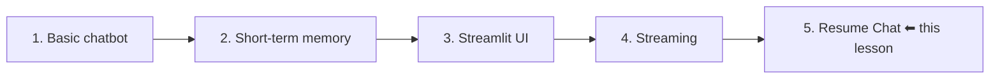
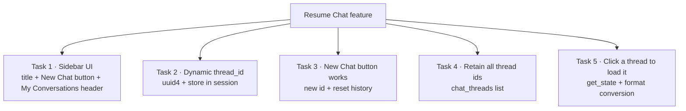
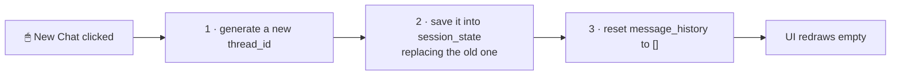
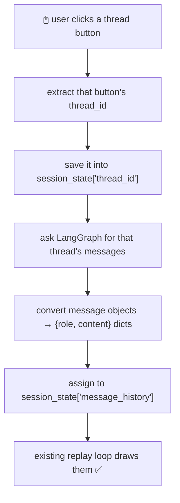
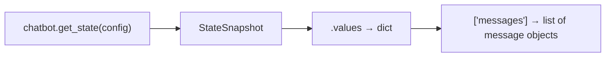
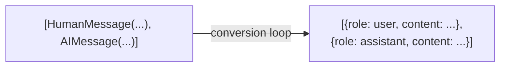
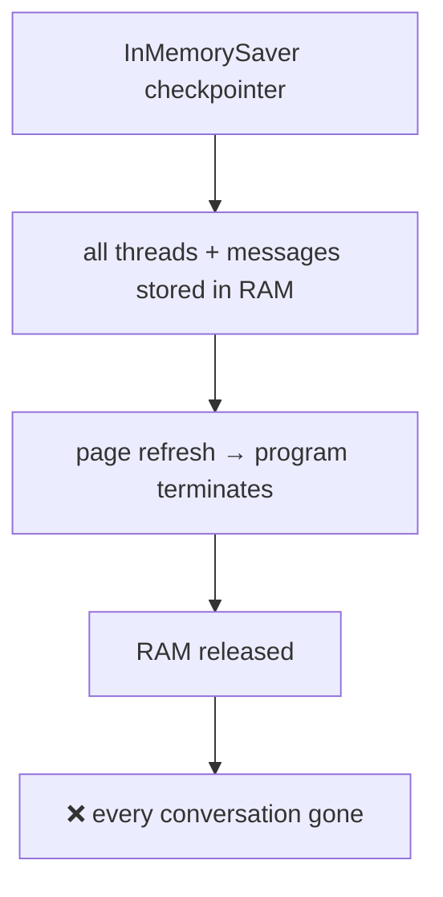

# Resume Chat — Multiple Conversations in a LangGraph Chatbot

> **One-line summary:** Generate a fresh `thread_id` per conversation with `uuid4`, keep every id in a `chat_threads` list inside `st.session_state`, render those ids as clickable sidebar buttons, and on click pull that thread's messages back with `chatbot.get_state()` — that's a ChatGPT-style "New Chat + past conversations" sidebar built from scratch.

---

## Overview

This is the fifth feature added to the same chatbot:



**What we're building.** Open ChatGPT and you get two options: start a **new** conversation on a new topic, or **resume** an existing one from days ago. Our chatbot currently has neither — it's one endless conversation on a single hardcoded thread.

After this lesson the app has two sections: the chat area, and a **sidebar** containing a **New Chat** button and a **My Conversations** list. Each past conversation is clickable and loads back into the main area, complete with its own separate memory.

**Demo behaviour to aim for:**

```
Thread A:  "write code to calculate factorial"  →  "my name is Nitish"
Thread B:  "write a 100 word blog on job crisis" →  "my name is Rahul"

Click Thread A → "what is my name?" → "Your name is Nitish."
Click Thread B → "what is my name?" → "Your name is Rahul."
```

**The backend needs zero changes.** The existing LangGraph backend is already sufficient — it has a checkpointer, and checkpointers already isolate state by `thread_id`. Everything in this lesson happens in the frontend.

---

## 1. The Method: Break the Feature Into Small Tasks

Before any code, a note on approach that's worth internalising:

> The most important skill in programming is taking the thing you need to build, **breaking it down into small tasks**, and executing them one by one. The big feature assembles itself.

The "resume chat" feature was decomposed like this:



Finish all five and the feature exists. We'll follow exactly that order.

---

## 2. Task 1 — The Sidebar UI

Target layout:

```
┌────────────────────────┬───────────────────────────────────┐
│  LangGraph Chatbot     │                                   │
│                        │   👤 hi, my name is Nitish         │
│  [   New Chat   ]      │   🤖 Hello Nitish! How can I...    │
│                        │                                   │
│  My Conversations      │                                   │
│  ┌──────────────────┐  │                                   │
│  │ 8f3a-...-8874    │  │                                   │
│  │ 1c92-...-4b01    │  │                                   │
│  └──────────────────┘  │   ┌───────────────────────────┐   │
│                        │   │ Type here...           ⏎  │   │
└────────────────────────┴───┴───────────────────────────┴───┘
       SIDEBAR                        MAIN CHAT AREA
```

In Streamlit, prefixing any element with **`st.sidebar.`** places it in the left sidebar instead of the main body.

```python
# ============================ Sidebar UI ============================
st.sidebar.title("LangGraph Chatbot")

st.sidebar.button("New Chat")          # no action yet

st.sidebar.header("My Conversations")
```

Run it:

```bash
streamlit run streamlit_frontend_threading.py
```

All three elements appear. The button does nothing yet — that's Task 3.

| Sidebar element | Purpose |
|---|---|
| `st.sidebar.title(...)` | App name at the top |
| `st.sidebar.button(...)` | Returns `True` on the rerun triggered by a click |
| `st.sidebar.header(...)` | Section heading for the conversation list |
| `st.sidebar.text(...)` | Plain text (used temporarily before switching to buttons) |

---

## 3. Task 2 — Dynamic Thread IDs with `uuid`

### The problem with the current code

```python
CONFIG = {"configurable": {"thread_id": "thread-1"}}   # ❌ hardcoded
```

This worked when there was exactly one conversation. But a user can click **New Chat** any number of times, creating any number of conversations. **You cannot know the ids in advance**, so you can't write them by hand. They must be generated **programmatically, one per new conversation**.

### The tool: `uuid4`

Python's `uuid` library generates a random unique identifier on demand.

```python
import uuid

# ============================ Utility functions ============================
def generate_thread_id():
    thread_id = uuid.uuid4()
    return thread_id
```

Every call returns a brand-new random id — perfect for "one per conversation."

### Store it in the session

```python
# ============================ Session setup ============================
if "message_history" not in st.session_state:
    st.session_state["message_history"] = []

if "thread_id" not in st.session_state:
    st.session_state["thread_id"] = generate_thread_id()
```

Read it plainly: *if no thread id has been generated yet, generate one and put it in the session.* The `session_state` guard means it happens once, not on every rerun.

### Use it in the config

```python
CONFIG = {"configurable": {"thread_id": st.session_state["thread_id"]}}

...

chatbot.stream(
    {"messages": [HumanMessage(content=user_input)]},
    config=CONFIG,                 # ← was an inline hardcoded dict
    stream_mode="messages",
)
```

| | Before | After |
|---|---|---|
| Thread id | `"thread-1"`, typed by hand | `uuid.uuid4()`, generated |
| Where it lives | Inline in the `stream()` call | `st.session_state["thread_id"]` |
| Number of conversations supported | Exactly one | Unlimited |
| Config | Inline dict, duplicated | A single `CONFIG` variable |

### Show the current thread id in the sidebar

```python
st.sidebar.text(st.session_state["thread_id"])
```

Reload and the current conversation's id appears under **My Conversations**. Useful for confirming things work before there's anything prettier to show.

---

## 4. Task 3 — Making "New Chat" Work

**What should happen on click:** the chat area clears, and the user gets a blank conversation on a fresh topic.

**Three things must happen behind the scenes:**



Step 3 matters because `message_history` is the list the UI loops over to draw messages. Empty the list → the screen clears.

### The utility function

```python
def reset_chat():
    thread_id = generate_thread_id()                    # 1
    st.session_state["thread_id"] = thread_id           # 2
    st.session_state["message_history"] = []            # 3
```

### Wiring it to the button

```python
if st.sidebar.button("New Chat"):
    reset_chat()
```

### Test it

```
1. Chat about "recipe of idli"          → note the thread id ends ...8874
2. Click New Chat
3. ✅ chat area goes blank
4. ✅ thread id changes to a new value
5. Chat about "program to swap two numbers in Python" → works, separate thread
```

**But a new problem appears:** the previous conversation's thread id is **gone**. Overwritten. There's no way back to the idli conversation.

---

## 5. Task 4 — Retaining Every Thread ID

**The fix:** keep a **list** of all thread ids, and put that list inside `session_state` so it survives reruns.

```python
if "chat_threads" not in st.session_state:
    st.session_state["chat_threads"] = []
```

### When do ids get added to this list?

**Twice**, and both matter:

| Moment | Why |
|---|---|
| **On first page load** | The initial auto-generated thread must be listed too |
| **Every New Chat click** | Each newly created thread must be listed |

Since the same job happens in two places, it becomes a utility function:

```python
def add_thread(thread_id):
    if thread_id not in st.session_state["chat_threads"]:
        st.session_state["chat_threads"].append(thread_id)
```

The `if ... not in ...` guard prevents the same id being appended repeatedly across reruns.

### Both call sites

```python
# --- session setup (page load) ---
if "chat_threads" not in st.session_state:
    st.session_state["chat_threads"] = []

add_thread(st.session_state["thread_id"])


# --- reset_chat (New Chat click) ---
def reset_chat():
    thread_id = generate_thread_id()
    st.session_state["thread_id"] = thread_id
    st.session_state["message_history"] = []
    add_thread(st.session_state["thread_id"])          # ← added
```

### Display all threads, not just the current one

```python
# was:  st.sidebar.text(st.session_state["thread_id"])

for thread_id in st.session_state["chat_threads"]:
    st.sidebar.text(str(thread_id))
```

Now every New Chat click **adds** a line rather than replacing one. Nothing is lost.

### Make them clickable

Text can't be clicked, so swap `text` for `button`:

```python
for thread_id in st.session_state["chat_threads"]:
    st.sidebar.button(str(thread_id))          # note str()
```

> ⚠️ `uuid4()` returns a **UUID object**, not a string. `st.button` expects a string, so wrap it: **`str(thread_id)`**. Skip this and the app errors out.

### Most-recent-first ordering

By default the oldest chat sits at the top — backwards compared to ChatGPT. Reverse the list when rendering:

```python
for thread_id in st.session_state["chat_threads"][::-1]:
    st.sidebar.button(str(thread_id))
```

---

## 6. Task 5 — Loading a Past Conversation

Goal: click a thread button → that conversation's full history appears in the main area.

### The plan



The final step needs no new code at all — the UI already loops over `message_history` and prints it.

### Getting messages out of LangGraph

Explored first in the backend as a scratch test:

```python
CONFIG = {"configurable": {"thread_id": "thread-1"}}

chatbot.invoke(
    {"messages": [HumanMessage(content="Hi, my name is Nitish")]},
    config=CONFIG,
)

print(chatbot.get_state(config=CONFIG))
```

That prints a large **`StateSnapshot`** object. The messages live under its **`.values`** attribute:

```python
chatbot.get_state(config=CONFIG).values
# {'messages': [HumanMessage(...), AIMessage(...)]}

chatbot.get_state(config=CONFIG).values["messages"]
# [HumanMessage(content='Hi, my name is Nitish'), AIMessage(content='Hello Nitish!...')]
```



> 🔁 As before, this was only a test. **Revert the backend afterwards** — it needs no changes.

### The utility function

```python
def load_conversation(thread_id):
    return chatbot.get_state(
        config={"configurable": {"thread_id": thread_id}}
    ).values["messages"]
```

### The format incompatibility

The two sides speak different languages:

| | LangGraph returns | `message_history` needs |
|---|---|---|
| Shape | List of message **objects** | List of **dictionaries** |
| Example | `HumanMessage(content="hi")` | `{"role": "user", "content": "hi"}` |
| Role encoded as | The **class** (`HumanMessage` / `AIMessage`) | A `"role"` string |



So a small manual conversion is needed: check each message's **class** with `isinstance`, and map it to the right role string.

### The complete click handler

```python
for thread_id in st.session_state["chat_threads"][::-1]:
    if st.sidebar.button(str(thread_id)):
        # 1. make this the active thread
        st.session_state["thread_id"] = thread_id

        # 2. fetch its messages from LangGraph
        messages = load_conversation(thread_id)

        # 3. convert object format -> dict format
        temp_messages = []
        for msg in messages:
            if isinstance(msg, HumanMessage):
                role = "user"
            else:
                role = "assistant"
            temp_messages.append({"role": role, "content": msg.content})

        # 4. hand it to the UI
        st.session_state["message_history"] = temp_messages
```

> ⚠️ **Step 1 is easy to forget.** Clicking a thread gives you its id, but unless you write it back into `st.session_state["thread_id"]`, the *next* message the user sends still goes to the old thread. Everything downstream depends on this line.

---

## 7. Complete Frontend Code

```python
import streamlit as st
import uuid

from langgraph_backend import chatbot
from langchain_core.messages import HumanMessage


# ==================== Utility functions ====================
def generate_thread_id():
    thread_id = uuid.uuid4()
    return thread_id


def reset_chat():
    thread_id = generate_thread_id()
    st.session_state["thread_id"] = thread_id
    st.session_state["message_history"] = []
    add_thread(st.session_state["thread_id"])


def add_thread(thread_id):
    if thread_id not in st.session_state["chat_threads"]:
        st.session_state["chat_threads"].append(thread_id)


def load_conversation(thread_id):
    return chatbot.get_state(
        config={"configurable": {"thread_id": thread_id}}
    ).values["messages"]


# ==================== Session setup ====================
if "message_history" not in st.session_state:
    st.session_state["message_history"] = []

if "thread_id" not in st.session_state:
    st.session_state["thread_id"] = generate_thread_id()

if "chat_threads" not in st.session_state:
    st.session_state["chat_threads"] = []

add_thread(st.session_state["thread_id"])

CONFIG = {"configurable": {"thread_id": st.session_state["thread_id"]}}


# ==================== Sidebar UI ====================
st.sidebar.title("LangGraph Chatbot")

if st.sidebar.button("New Chat"):
    reset_chat()

st.sidebar.header("My Conversations")

for thread_id in st.session_state["chat_threads"][::-1]:
    if st.sidebar.button(str(thread_id)):
        st.session_state["thread_id"] = thread_id

        messages = load_conversation(thread_id)

        temp_messages = []
        for msg in messages:
            if isinstance(msg, HumanMessage):
                role = "user"
            else:
                role = "assistant"
            temp_messages.append({"role": role, "content": msg.content})

        st.session_state["message_history"] = temp_messages


# ==================== Main chat area ====================
for message in st.session_state["message_history"]:
    with st.chat_message(message["role"]):
        st.text(message["content"])

user_input = st.chat_input("Type here")

if user_input:
    st.session_state["message_history"].append(
        {"role": "user", "content": user_input}
    )
    with st.chat_message("user"):
        st.text(user_input)

    with st.chat_message("assistant"):
        ai_message = st.write_stream(
            message_chunk.content
            for message_chunk, metadata in chatbot.stream(
                {"messages": [HumanMessage(content=user_input)]},
                config=CONFIG,
                stream_mode="messages",
            )
        )

    st.session_state["message_history"].append(
        {"role": "assistant", "content": ai_message}
    )
```

---

## 8. Reference Tables

### The three session-state keys

| Key | Type | Holds | Reset when |
|---|---|---|---|
| `message_history` | `list[dict]` | The **currently displayed** conversation | New Chat clicked, or a thread is loaded |
| `thread_id` | `UUID` | The **active** conversation's id | New Chat clicked, or a thread is clicked |
| `chat_threads` | `list[UUID]` | **All** conversation ids created this session | Never (only on page refresh) |

### The four utility functions

| Function | Input | Output / effect |
|---|---|---|
| `generate_thread_id()` | — | A fresh random `UUID` |
| `reset_chat()` | — | New id + cleared history + id registered |
| `add_thread(thread_id)` | a thread id | Appends to `chat_threads` if not already there |
| `load_conversation(thread_id)` | a thread id | List of LangGraph message objects for that thread |

### Two memories, revisited

| | `st.session_state` | LangGraph checkpointer |
|---|---|---|
| Holds | `message_history`, `thread_id`, `chat_threads` | The actual conversation state per thread |
| Purpose | What the **UI draws** | What the **LLM remembers** |
| Isolation mechanism | The `chat_threads` list | `thread_id` |
| Lost on | Browser page refresh | Process restart (`InMemorySaver` = RAM) |

Clicking a sidebar button is precisely the moment these two systems are re-synced: LangGraph's stored messages are pulled out and rewritten into the UI's format.

---

## 9. Common Pitfalls / Gotchas

1. **Passing a UUID object to `st.button`.** `uuid4()` returns a UUID, not a string, and the button expects a string. Wrap it: `st.sidebar.button(str(thread_id))`. This error was hit live.

2. **Forgetting to update `session_state["thread_id"]` when a thread is clicked.** You'd see the old conversation load, but the next message would still be written to the previous thread. The click handler must set the active id first.

3. **Calling `add_thread` in only one place.** It's needed on **page load** *and* inside **`reset_chat`**. Miss the first and the very first conversation never appears in the sidebar; miss the second and new chats don't get listed.

4. **Omitting the `if thread_id not in ...` guard.** Because the script reruns constantly, `add_thread` fires repeatedly and the same id piles up in the list.

5. **Keeping the hardcoded `thread_id`.** With `"thread-1"` fixed, every "new" chat writes into the same LangGraph thread — separate UI, shared memory.

6. **Resetting one but not the other in `reset_chat`.** New id without clearing `message_history` → old messages linger over a fresh thread. Cleared history without a new id → blank screen, but the LLM still remembers the previous topic.

7. **Assuming LangGraph's messages drop straight into `message_history`.** They don't. LangGraph gives `[HumanMessage(...), AIMessage(...)]`; the UI needs `[{"role": ..., "content": ...}]`. The `isinstance` conversion loop is mandatory — and `HumanMessage` must be imported for it.

8. **Forgetting `.values["messages"]`.** `get_state()` returns a `StateSnapshot`, not a list. Drill down: `.values` → `["messages"]`.

9. **Leaving the `get_state` experiment in the backend.** That exploration was scratch work. Revert `langgraph_backend.py`.

10. **Oldest-chat-first ordering.** Natural list order puts the oldest at the top. Reverse it with `[::-1]` to match ChatGPT's convention.

11. **Running the wrong filename.** `streamlit run <name>.py` fails with *"file does not exist"* if the name doesn't match. (This happened live — the file was named `...streaming.py` while the command said `...threading.py`.)

12. **Expecting conversations to survive a browser refresh.** They don't — see the next section.

---

## 10. Known Limitation → What Comes Next

Refresh the page and **all past conversations disappear**. The reason:



`InMemorySaver` is a RAM-based checkpointer. When the program terminates, the associated memory goes with it.

**The fix (next lesson):** connect the LangGraph backend to a **database-backed checkpointer**. Then past conversations stay intact — chat today, come back four days later, and your messages are exactly where you left them.

**Homework left open:** instead of showing raw UUIDs in the sidebar, give each conversation a **logical name/title**, the way ChatGPT does.

**Roadmap beyond that:** tools, MCP principles, and RAG added to this same chatbot.

---

## 11. Key Concepts Worth Remembering

- **Break a big feature into small tasks and execute them in order.** That's the actual technique on display here.
- **The backend needs no changes.** Checkpointers already isolate conversations by `thread_id`; the frontend just has to use that properly.
- **One conversation = one `thread_id`.** Hardcoding it caps you at exactly one conversation.
- **`uuid.uuid4()` generates thread ids programmatically** — you can't know in advance how many the user will create.
- **Three session keys carry the whole feature:** `message_history` (what's drawn), `thread_id` (what's active), `chat_threads` (everything created).
- **`chat_threads` must live in `session_state`**, or reruns wipe it.
- **`add_thread` is called twice:** on page load and inside `reset_chat`.
- **"New Chat" does exactly three things:** new id → save to session → clear `message_history`.
- **Emptying `message_history` is what visually clears the screen.**
- **`chatbot.get_state(config).values["messages"]`** retrieves any thread's messages.
- **Formats don't match:** LangGraph returns message objects, the UI needs `{role, content}` dicts — convert with `isinstance(msg, HumanMessage)`.
- **On click, set the active `thread_id` first**, then load and convert.
- **`str(thread_id)`** for buttons; **`[::-1]`** for recent-first ordering.
- **`InMemorySaver` = RAM = everything dies on refresh.** A database checkpointer is the cure.

---

## Summary

Resume Chat turns a single-conversation bot into a multi-conversation one, and it's built entirely in the frontend because LangGraph's checkpointer already separates state by `thread_id`. The work is generating those ids dynamically with `uuid4` instead of hardcoding one, keeping the active id in `st.session_state`, and — crucially — collecting every id ever created into a `chat_threads` list that survives Streamlit's constant reruns.

From there the sidebar writes itself: a **New Chat** button that generates a fresh id and empties `message_history` to clear the screen, and a loop rendering each stored id as a clickable button. Clicking one sets it as the active thread, pulls its messages back via `chatbot.get_state(config).values["messages"]`, converts them from LangGraph's message objects into the `{role, content}` dictionaries the UI expects, and drops them into `message_history` — where the existing replay loop takes over with no new code.

Two details are easy to trip on: `st.button` needs `str(thread_id)` because `uuid4` returns an object, and the click handler must write the clicked id back into the session or subsequent messages land in the wrong thread. The remaining limitation is storage — `InMemorySaver` keeps everything in RAM, so a page refresh erases all conversations, which a database-backed checkpointer solves next.
