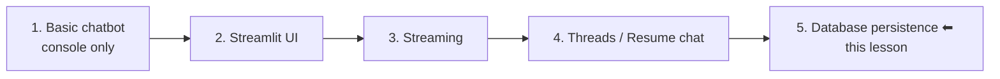
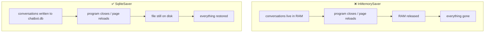
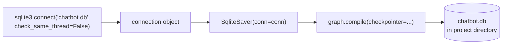
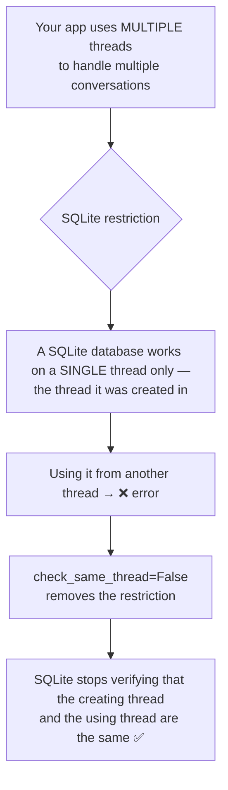
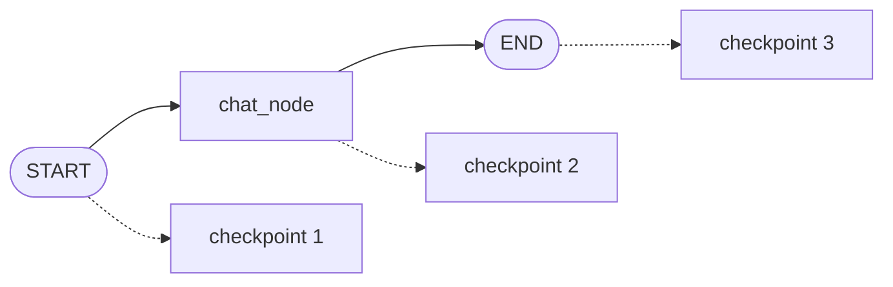
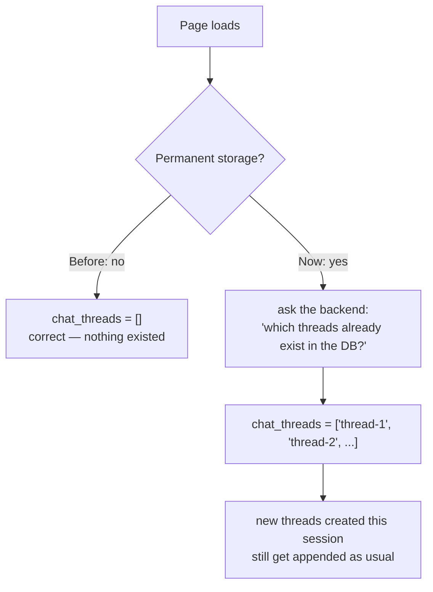
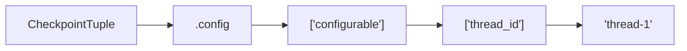

# Persistent Storage — Connecting a LangGraph Chatbot to a Database

> **One-line summary:** Swap `InMemorySaver` for `SqliteSaver` backed by a real `sqlite3` connection, add a `retrieve_all_threads()` helper that scans the checkpoint table for unique thread ids, and seed the Streamlit sidebar from it — so conversations survive a page refresh, a program restart, and four days away.

---

## Overview

This completes the chatbot arc:



**The problem.** Short-term memory has been implemented with `InMemorySaver`, which stores every conversation in **RAM**. Close the application — or simply reload the page — and every conversation vanishes. There is no permanent storage.

**The fix.** Remove `InMemorySaver` and use a different checkpointer, one wired to an actual **database**. Every message the user sends and every AI reply gets written to that database. Then the application can close, the page can refresh, and conversations stay intact. Come back three or four days later and resume from exactly where you left off.

**Scope note:** unlike the previous lesson, this one requires changes in **both** the backend (LangGraph) and the frontend (Streamlit).

Two new files:

```
langgraph_database_backend.py     ← copy of the old backend + checkpointer changes
streamlit_frontend_database.py    ← copy of the old frontend + one line changed
```

---

## 1. The Three Checkpointers

LangGraph's documentation lists three checkpointer types:

| Checkpointer | Backed by | Survives restart? | Intended for |
|---|---|---|---|
| `InMemorySaver` | RAM | ❌ No | What we've used so far — demos, learning |
| **`SqliteSaver`** | A SQLite file | ✅ Yes | **Prototyping** — small database, not really used for production-grade work |
| `PostgresSaver` | Postgres — a proper database | ✅ Yes | **Production-grade** chatbots |

We're still in the learning phase, so we stick with **`SqliteSaver`**.



---

## 2. Backend — Installing and Wiring `SqliteSaver`

### Step 1: install the library

`SqliteSaver` is **not built into LangGraph**. It's an external package — most likely community-developed, and quite plausibly folded into LangGraph in a future version. For now, install it separately.

```bash
pip install langgraph-checkpoint-sqlite
```

> Tip from the walkthrough: search for `langgraph checkpoint sqlite`, the top result gives you the install command to copy. Run it inside your virtual environment.

### Step 2: change the import

```python
# BEFORE
from langgraph.checkpoint.memory import InMemorySaver

# AFTER
from langgraph.checkpoint.sqlite import SqliteSaver
```

### Step 3: create a database connection and pass it in

`SqliteSaver` doesn't work standalone. Behind the scenes you must **create a SQLite database** and **connect the checkpointer to it**.

```python
import sqlite3

conn = sqlite3.connect(database="chatbot.db", check_same_thread=False)
checkpointer = SqliteSaver(conn=conn)
```

Two lines, and you have a database-backed checkpointer.



**About the database file:** if `chatbot.db` doesn't already exist, it is **created automatically** once the command runs — inside your project directory.

**Communication is automatic.** Once the checkpointer holds the connection, LangGraph handles all the writing internally. You never write SQL.

### Step 4: `check_same_thread=False` — why it's required

This parameter defaults to `True`, and leaving it that way makes your code **error out**. Here's the reasoning:



Read the parameter as: *"we will use this same database across different threads — don't worry about it."* It's a somewhat technical detail; for our workflow, all that matters is that it must be `False`.

### The full backend

```python
# langgraph_database_backend.py
from typing import TypedDict, Annotated
import sqlite3

from langgraph.graph import StateGraph, START, END
from langgraph.graph.message import add_messages
from langgraph.checkpoint.sqlite import SqliteSaver          # ← changed
from langchain_core.messages import BaseMessage
from langchain_openai import ChatOpenAI
from dotenv import load_dotenv

load_dotenv()

llm = ChatOpenAI()


class ChatState(TypedDict):
    messages: Annotated[list[BaseMessage], add_messages]


def chat_node(state: ChatState):
    response = llm.invoke(state["messages"])
    return {"messages": [response]}


# ---------- database-backed checkpointer ----------
conn = sqlite3.connect(database="chatbot.db", check_same_thread=False)
checkpointer = SqliteSaver(conn=conn)


graph = StateGraph(ChatState)
graph.add_node("chat_node", chat_node)
graph.add_edge(START, "chat_node")
graph.add_edge("chat_node", END)

chatbot = graph.compile(checkpointer=checkpointer)
```

| | Before | After |
|---|---|---|
| Import | `...checkpoint.memory import InMemorySaver` | `...checkpoint.sqlite import SqliteSaver` |
| Setup | `checkpointer = InMemorySaver()` | `conn = sqlite3.connect(...)` + `SqliteSaver(conn=conn)` |
| Extra dependency | none | `langgraph-checkpoint-sqlite`, `sqlite3` |
| Storage | RAM | `chatbot.db` on disk |
| Everything else | — | **unchanged** |

---

## 3. Proving It Works

A scratch test written directly in the backend:

```python
from langchain_core.messages import HumanMessage

CONFIG = {"configurable": {"thread_id": "thread-1"}}

response = chatbot.invoke(
    {"messages": [HumanMessage(content="Hi, my name is Nitish")]},
    config=CONFIG,
)
print(response)
```

**Two things to observe on the first run:**

1. The response prints — your message plus the AI's reply.
2. A **`chatbot.db` file appears** in your project directory, created automatically.

### The persistence proof

Now change the message and run the **same file again** — a completely fresh process:

```python
response = chatbot.invoke(
    {"messages": [HumanMessage(content="What is my name?")]},
    config=CONFIG,
)
```

With `InMemorySaver` you would get **nothing** — the program ran once and terminated, so memory was cleared. With `SqliteSaver`, it reads the database, finds the earlier messages, and answers correctly.

```
Run 1 output:  2 messages
Run 2 output:  4 messages   ← 2 from the previous run + 2 from this one
               "Your name is Nitish."
```

The two older messages came back **because they were safely stored in the database**.

### The thread-isolation proof

```python
CONFIG = {"configurable": {"thread_id": "thread-2"}}   # ← different thread
# "Hi, my name is Rahul"        → 2 messages in thread-2
# "What is my name?"            → "Your name is Rahul", 4 messages in thread-2
```

Switch back and forth freely:

| Thread | Question | Answer |
|---|---|---|
| `thread-1` | "What is the capital of India? Acknowledge my name while answering." | *"...New Delhi. Thank you for your question, **Nitish**..."* |
| `thread-2` | same question | *"...Thanks for asking, **Rahul**..."* |

Two things are demonstrated at once: **messages survive program termination**, and **each thread is stored separately** and retrievable by its `thread_id`.

---

## 4. Looking Inside the Database

Worth doing — it makes the whole mechanism concrete.

**Option used here:** a VS Code extension. Go to Extensions, search **sqlite**, and install one of the two or three options — the walkthrough uses **SQLite Viewer** (publisher: Florian Klampfer). Then just click `chatbot.db` and view it inside VS Code. Other standalone software can open `.db` files too, but staying inside VS Code is the most straightforward path.

### What you'll see

All your checkpoints, with `thread-1` and `thread-2` appearing **repeatedly**. That repetition is not a bug.



**This workflow creates three checkpoints per execution** — one at START, one at the chat node, one at END.

So the arithmetic works out:

| Run | Thread | Checkpoints added |
|---|---|---|
| "Hi, my name is Nitish" | thread-1 | 3 |
| "What is my name?" | thread-1 | 3 |
| "Hi, my name is Rahul" | thread-2 | 3 |
| "What is my name?" | thread-2 | 3 |
| "Capital of India + my name" | thread-1 | 3 |
| "Capital of India + my name" | thread-2 | 3 |
| **Total** | **2 unique threads** | **18 checkpoints** (9 each) |

Double-click into a checkpoint and you can read the messages stored in it — the human messages and AI messages of that conversation, in order.

> If the checkpoint counting is unclear, revisit the **persistence** lesson, where exactly when and where each checkpoint is created is covered in detail.

---

## 5. Frontend — Seeding the Sidebar From the Database

**Only one place changes** in the entire frontend: the **session setup**, specifically how `chat_threads` is initialised.

### Why it has to change

Recall the three session keys:

| Key | Holds |
|---|---|
| `message_history` | All messages of the current thread |
| `thread_id` | The currently active conversation |
| `chat_threads` | Every thread that exists in the chatbot |

The old code initialised `chat_threads` as an **empty list**. That was perfectly logical **before** — with no permanent storage, every fresh load genuinely had zero threads.

But now past threads live in the database. Starting from zero throws them away.



So: **on load, go ask the backend how many threads exist in the database, and fill the list with them.**

---

## 6. Backend — Building `retrieve_all_threads()`

### The `.list()` function

The **checkpointer object** has a `.list()` method. It can return:

- **all checkpoints** currently in the database, or
- the checkpoints belonging to **one particular thread**, if you name one.

```python
checkpointer.list(None)   # None = don't filter by thread → give me everything
```

Passing `None` means *"I don't want a particular thread's checkpoints — I want all of them."*

### It returns a generator

Running it prints a generator object rather than a big output. Fine — loop over it:

```python
for checkpoint in checkpointer.list(None):
    print(checkpoint)
```

Now you get a genuinely frightening output — 18 `CheckpointTuple` objects, each carrying a lot of metadata.

### Drilling down to the thread id



```python
for checkpoint in checkpointer.list(None):
    print(checkpoint.config)                                # narrower
    print(checkpoint.config["configurable"])                # narrower still
    print(checkpoint.config["configurable"]["thread_id"])   # just the id
```

### Deduplicating with a set

The thread ids **repeat** — nine occurrences each. The goal is *unique* threads, so collect them in a **set**, which only keeps unique values, then convert to a list at the end.

```python
def retrieve_all_threads():
    all_threads = set()
    for checkpoint in checkpointer.list(None):
        all_threads.add(checkpoint.config["configurable"]["thread_id"])
    return list(all_threads)
```

Anyone calling this function gets back a list of every unique thread that exists in the database at this point in time. Add a third thread later, and it shows up automatically.

---

## 7. Frontend — The One-Line Change

```python
# import from the NEW backend filename, and bring in the new function
from langgraph_database_backend import chatbot, retrieve_all_threads

...

# BEFORE
if "chat_threads" not in st.session_state:
    st.session_state["chat_threads"] = []

# AFTER
if "chat_threads" not in st.session_state:
    st.session_state["chat_threads"] = retrieve_all_threads()
```

That's it. Everything else — the sidebar loop, the New Chat button, `load_conversation`, the streaming block — executes as before.

### Complete session-setup block

```python
import streamlit as st
import uuid
from langgraph_database_backend import chatbot, retrieve_all_threads
from langchain_core.messages import HumanMessage


# ==================== Session setup ====================
if "message_history" not in st.session_state:
    st.session_state["message_history"] = []

if "thread_id" not in st.session_state:
    st.session_state["thread_id"] = generate_thread_id()

if "chat_threads" not in st.session_state:
    st.session_state["chat_threads"] = retrieve_all_threads()   # ← the change

add_thread(st.session_state["thread_id"])

CONFIG = {"configurable": {"thread_id": st.session_state["thread_id"]}}
```

---

## 8. The Result

```bash
streamlit run streamlit_frontend_database.py
```

**On the very first load**, `thread-1` and `thread-2` are already listed in the sidebar — and clicking either shows the conversation that was created earlier from the backend test script. The Nitish thread and the Rahul thread are both there, intact.

Create a new chat (say, a biryani recipe) and it becomes a third thread. Switch between all three freely.

**The real test:** close the program entirely — out of RAM — and run it again.

```
✅ thread-1  → Nitish's conversation
✅ thread-2  → Rahul's conversation
✅ thread-3  → the biryani conversation
```

Refresh, close, do whatever you like, come back four days later — open the site and your old chats are there.

---

## 9. Comparison Tables

### Where the changes landed

| File | Change |
|---|---|
| `langgraph_database_backend.py` | New import, `sqlite3` connection, `SqliteSaver`, new `retrieve_all_threads()` function |
| `streamlit_frontend_database.py` | Updated import line, and `chat_threads` seeded from `retrieve_all_threads()` |
| Everything else | Untouched |

### `InMemorySaver` vs `SqliteSaver` in practice

| | `InMemorySaver` | `SqliteSaver` |
|---|---|---|
| Setup | `InMemorySaver()` | connection + `SqliteSaver(conn=conn)` |
| Extra install | none | `langgraph-checkpoint-sqlite` |
| Where data lives | RAM | `chatbot.db` file |
| Page refresh | ❌ all lost | ✅ intact |
| Program restart | ❌ all lost | ✅ intact |
| Inspectable | no | yes — open the `.db` file |
| Suitable for | learning, demos | prototyping |

### Retrieval API used across the project

| Call | On what | Returns |
|---|---|---|
| `chatbot.get_state(config)` | compiled graph | A `StateSnapshot` for **one** thread |
| `chatbot.get_state(config).values["messages"]` | ↑ | That thread's message list |
| `checkpointer.list(None)` | the **checkpointer** | Generator of **all** `CheckpointTuple`s |
| `checkpoint.config["configurable"]["thread_id"]` | one tuple | That checkpoint's thread id |

---

## 10. Common Pitfalls / Gotchas

1. **Forgetting to install `langgraph-checkpoint-sqlite`.** It isn't bundled with LangGraph. The import fails until you install it into the **virtual environment** you're actually running from.

2. **Leaving `check_same_thread` at its default (`True`).** Your app uses multiple threads for multiple conversations, and SQLite refuses cross-thread use by default. This throws an error. It must be `check_same_thread=False`.

3. **Trying to use `SqliteSaver()` with no connection.** It doesn't work standalone — it needs a `sqlite3` connection object passed as `conn`.

4. **Treating `checkpointer.list(None)` as a list.** It returns a **generator**. Loop over it; don't index it.

5. **Skipping the `set`.** Thread ids repeat once per checkpoint — nine times each in the walkthrough's database. Without deduplication your sidebar shows the same conversation nine times.

6. **Still initialising `chat_threads = []`.** This is the one frontend line that matters. Leave it and the database might be full of conversations while the sidebar shows nothing.

7. **Forgetting to update the frontend import.** The backend filename changed to `langgraph_database_backend`, and you now need `retrieve_all_threads` alongside `chatbot`.

8. **Leaving the scratch `invoke` test in the backend.** As in previous lessons, that testing code was temporary — remove it once verified.

9. **Mixing UUID objects and strings as thread ids.** Ids that come back from the database are strings, while `uuid.uuid4()` produces UUID objects — and a UUID is not equal to its own string form. If `add_thread`'s `not in` check compares the two types, the same conversation can end up listed twice. Being consistent (e.g. converting to `str` at generation time) avoids the mismatch.

10. **Assuming SQLite is production-ready.** It's a prototyping database. For production-grade chatbots, move to `PostgresSaver`.

11. **Forgetting `chatbot.db` is a real file.** It sits in your project directory. Delete it and every conversation is gone; commit it to git and you've committed your chat history.

---

## 11. Key Concepts Worth Remembering

- **The problem:** `InMemorySaver` = RAM, so closing the app or reloading the page erases every conversation.
- **The fix:** a database-backed checkpointer — `SqliteSaver`.
- **Three checkpointers:** `InMemorySaver` (RAM, demos), `SqliteSaver` (prototyping), `PostgresSaver` (production).
- **`SqliteSaver` needs an external install:** `langgraph-checkpoint-sqlite`.
- **Two lines set it up:** `sqlite3.connect(database="chatbot.db", check_same_thread=False)` then `SqliteSaver(conn=conn)`.
- **`check_same_thread=False` is mandatory** because SQLite defaults to single-thread use and your app is multi-threaded.
- **The `.db` file is created automatically** in the project directory on first run.
- **LangGraph does all the reading and writing** — you never write SQL.
- **This workflow creates 3 checkpoints per execution** — START, chat node, END.
- **`checkpointer.list(None)`** returns a generator of every checkpoint in the database.
- **Thread id path:** `checkpoint.config["configurable"]["thread_id"]`.
- **Use a `set` to deduplicate**, then return a `list`.
- **The whole frontend change is one line:** `chat_threads = retrieve_all_threads()` instead of `[]`.
- **A VS Code SQLite extension lets you see the checkpoints**, which makes the concept click.

---

## Summary

Everything built so far had one fatal weakness: `InMemorySaver` kept conversations in RAM, so a page reload or a closed program wiped them out. Replacing it with `SqliteSaver` — an external package installed via `langgraph-checkpoint-sqlite` — moves that storage onto disk. Setup is two lines: open a `sqlite3` connection to `chatbot.db` with `check_same_thread=False` (required, because SQLite is single-threaded by default while the app juggles multiple conversation threads), then hand that connection to `SqliteSaver`. LangGraph handles all reads and writes from there.

The proof is easy to run: invoke once, kill the process, invoke again, and the model still knows your name — with two threads storing Nitish and Rahul independently. Opening `chatbot.db` in a VS Code SQLite viewer shows exactly why there are eighteen checkpoints for two threads: this workflow writes three checkpoints per execution, at START, at the chat node, and at END.

On the frontend, only one line needed changing. `chat_threads` used to start as an empty list, which was correct when nothing persisted. Now it's seeded by a new backend helper, `retrieve_all_threads()`, which walks `checkpointer.list(None)`, pulls `config["configurable"]["thread_id"]` from each checkpoint, deduplicates through a set, and returns a list. The sidebar then populates itself on load, and every other piece of existing logic runs untouched — leaving a chatbot whose conversations are still waiting for you four days later.
