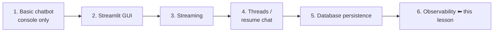
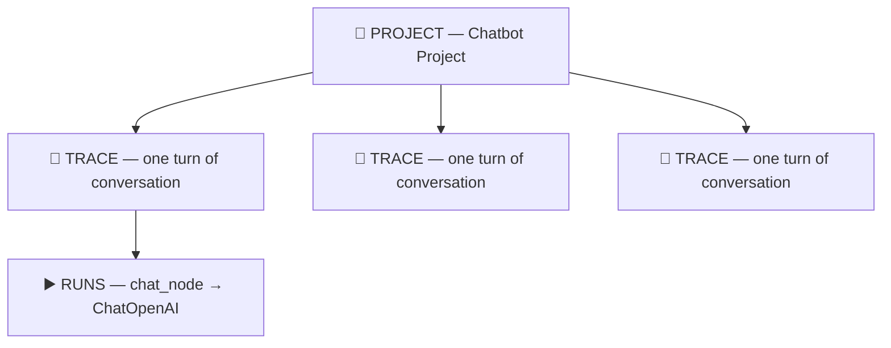
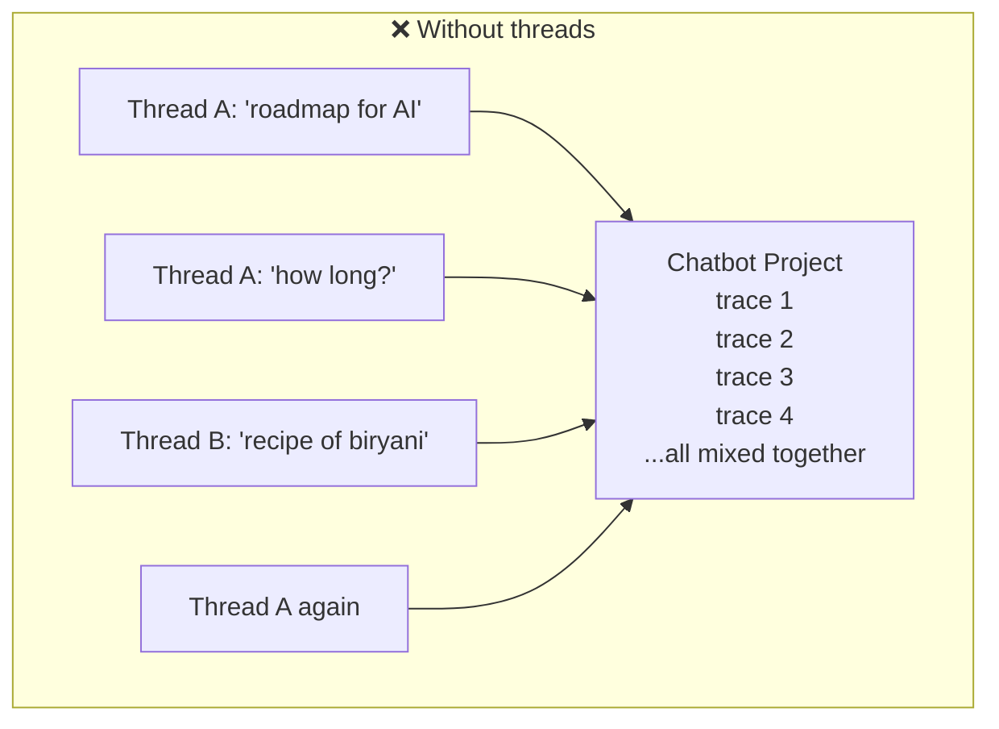
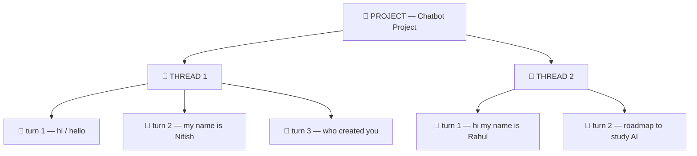
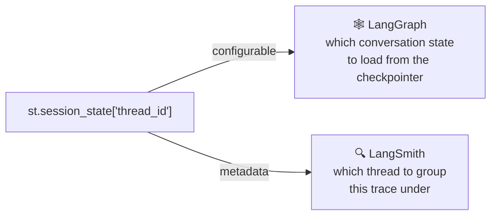

# Adding Observability to the Chatbot — LangSmith Threads

> **One-line summary:** Drop four environment variables into `.env` and LangSmith starts tracing your chatbot with zero code changes — but every conversation dumps into one undifferentiated pile until you add a `metadata.thread_id` to your config, which groups traces into **threads** that mirror your chatbot's actual conversations.

---

## Overview

The chatbot so far:



At this point the chatbot has a GUI for users to interact through, streaming so nobody waits for the LLM's response, and database persistence — chat today, shut the machine down, come back four days later, and your old chats are intact.

**Today's addition: observability.**

> ⚠️ **Prerequisite, stated plainly in the video:** this lesson does **not** teach observability or LangSmith from scratch. There's a separate ~2-hour LangSmith crash course covering both, and without it this material won't make much sense. Watch that first — it gives you the observability concept *and* detailed hands-on LangSmith work.

**Observability in one paragraph, in this context:** we're going to trace our chatbot's execution **end to end**. A user arrives, starts chatting — whatever message they send, whatever reply comes back, all of it gets recorded in a piece of software called **LangSmith**. Plus token usage, latency, and how every internal part of the chatbot is working.

**Why bother now?** Because of what's coming. In the next videos we add more complex features — **tools**, **RAG**, **MCP**. Having observability already in place makes those far easier to understand as they're built.

---

## 1. Setup

### Step 1 — Create an account

Go to `smith.langchain.com` and sign up (or log in).

### Step 2 — Generate an API key

The API key is what lets LangGraph and LangSmith talk to each other.

```
Settings → API Keys → click the API Key button
       → provide a description
       → Create API Key
       → copy it somewhere
```

### Step 3 — Add the environment variables

Paste into your project's `.env` file:

```bash
LANGSMITH_TRACING=true
LANGSMITH_ENDPOINT=https://api.smith.langchain.com
LANGSMITH_API_KEY=lsv2_...
LANGSMITH_PROJECT=Chatbot Project
```

| Variable | What it does |
|---|---|
| `LANGSMITH_TRACING` | The master switch — must be `true` |
| `LANGSMITH_ENDPOINT` | LangSmith's URL |
| `LANGSMITH_API_KEY` | Exactly the key you just created |
| `LANGSMITH_PROJECT` | The project name that will appear in LangSmith |

> 📝 You may see the older `LANGCHAIN_TRACING_V2` / `LANGCHAIN_ENDPOINT` / `LANGCHAIN_API_KEY` / `LANGCHAIN_PROJECT` naming in other material. Same four settings, `LANGSMITH_*` is the newer prefix.

**On projects:** LangSmith organises everything under **Tracing Projects**. Before you run anything, that section may be empty (or show your past projects). The moment you run this project, a project named **Chatbot Project** appears there, and all of the chatbot's tracing lands inside it.

That's the whole setup. **You're ready to go.**

---

## 2. Zero Code Changes

The best thing about LangSmith: once the setup above is ready, **you don't touch your main code at all**. LangSmith automatically traces behind the scenes.

Re-run the *exact* same code from the database-persistence lesson — no changes whatsoever:

```bash
streamlit run streamlit_frontend_database.py
```

Chat normally: *"Give me a roadmap to study AI engineering."* The chatbot behaves exactly as it should. But behind the scenes LangSmith has started working.

Open the LangSmith dashboard → **Tracing Projects** → **Chatbot Project** is there, created purely because of the environment variable.

---

## 3. How LangSmith Organises It



- **Top level = Project.** We created one called *Chatbot Project*.
- **Every time the user talks to the chatbot, LangSmith captures a trace.** One message sent + one reply back = **one single trace**.
- Send a second message → a second, separate trace appears.

### What's inside a trace

Click any trace and you get:

| Field | Detail |
|---|---|
| **Node name** | `chat_node` — the LangGraph node |
| **Model** | `ChatOpenAI` — the LLM used inside that node |
| **Input** | What went in |
| **Output** | What the LLM returned |
| **Start / end time** | When execution began and finished |
| **Time to first token** | Latency before streaming started |
| **Status** | Success / error |
| **Total tokens** | Both input tokens and output tokens |
| **Latency** | How long the response took to generate |

All of it in one place. You can return at any point in the future and check what the user asked, what answer they got, and how long it took. **That's why it's called observability.**

---

## 4. The Problem: Everything Lands in One Pile

Here's what nags — and it's a completely valid objection.

Open a **new thread** in the chatbot (a genuinely separate conversation) and type *"recipe of biryani."* Go back to LangSmith and you'll see a **third trace**, stored in exactly the same place as the previous thread's messages.

Switch back to the earlier thread and chat again — that message also lands in the same undifferentiated list.



So every message from every separate conversation is being stored in one place. That's **mismanaged**. Different conversations should be stored differently.

**LangSmith's creators thought about this and provided a solution.**

---

## 5. The Solution: LangSmith Threads

You can organise all your traces **inside threads**.

This maps perfectly onto the chatbot, which already uses the threading concept: start a new conversation → a new thread is created → all that chat is stored inside it. LangSmith lets you create matching **conversational threads**, and each thread's messages get stored automatically inside that thread.



**The catch:** setting threads up requires a little extra code.

### Finding the guidance

Go to the **Threads** section in LangSmith. Right now it says *"No thread found."* Below that there's a link: **Learn how to log your first thread**. The documentation states it simply:

> To implement threads, you must **explicitly mention a thread ID** while executing your code.

And it accepts any one of three key names:

| Accepted key | Notes |
|---|---|
| `thread_id` | Used here |
| `session_id` | Equivalent |
| `conversation_id` | Equivalent |

Mention one of these while **invoking your chatbot**.

---

## 6. The Code Change

### Before

```python
CONFIG = {
    'configurable': {'thread_id': st.session_state['thread_id']}
}
```

This config already existed — it was built so it could be sent to the chatbot's **backend**, i.e. LangGraph, which reads it and organises messages into threads via the checkpointer.

### After

```python
CONFIG = {
    'configurable': {'thread_id': st.session_state['thread_id']},
    'metadata':     {'thread_id': st.session_state['thread_id']},
    'run_name':     'chat_turn',
}
```

Replace the old config variable with this one everywhere it's used.

### What actually changed

| Part | Status | Purpose |
|---|---|---|
| `configurable` | **Exactly the same** as before | Tells **LangGraph** which conversation's state to load |
| `metadata` | **New** | Tells **LangSmith** which thread to group this trace under |
| `run_name` | **New, optional** | Renames the trace for readability |

### 🔑 The key insight: one ID, two jobs

The same `thread_id` value is doing **two entirely separate jobs** for **two different systems**, and each has to be told independently.



This is why adding `configurable.thread_id` alone doesn't produce threads in LangSmith — LangSmith never looks there. It reads **metadata**.

### On `run_name`

Optional, purely cosmetic — you can remove it. But by default every trace is named **`LangGraph`**, which isn't accurate or informative; looking at it tells you nothing about what it represents.

Since **each trace represents one turn of conversation** — you say something, the chatbot replies back, that's one turn — naming it `chat_turn` is far more readable.

---

## 7. Testing It

> Tip used in the walkthrough: **delete the existing Chatbot Project** in LangSmith first, so tracing starts from scratch and there's no confusion between old and new traces.

### Turn 1

Chat: *"hi"* → *"Hello. How can I assist you?"*

- **Tracing Projects** → the project reappears (refresh if needed)
- One trace visible. The only difference from before: it says **chat turn** instead of **LangGraph**, thanks to `run_name`
- Open it — nothing new inside, same detail as before
- **Now go to Threads** → **one thread appears**, containing **one trace / one turn**
- Click it → a proper conversational UI: Human said *hi*, AI said *hello how can I assist you*

### Turn 2

Say *"my name is Nitish"* → reply comes back.

- **Tracing Projects** → now **two traces**
- **Threads** → still **one thread**, but now with **two traces inside it**
- Click through → Turn 1 and Turn 2 laid out in order (hover over each to see them)

### Turn 3

*"Who created you?"* → *"I was created by OpenAI."* Wait a moment and the third turn appears in the thread.

### A brand-new conversation

Create a new thread in the chatbot: *"hi my name is Rahul"*, then *"what is the roadmap to study AI"*.

- **Tracing Projects** → lots of traces, but **looking there isn't useful any more** — it's the flat pile again
- **Threads** → a **new thread** has been created and appears at the top
- Click it → the second conversation, properly arranged: *hi my name is Rahul* / *hello Rahul* / *what is the roadmap to study AI* / the answer

Every turn is captured. Click any individual turn to study it — exactly what was said, what the AI replied, the latency, the tokens used. **All arranged in one place.**

From here on, every new conversation you create on the chatbot is stored beautifully in thread form in LangSmith, with all traces sitting inside their respective threads.

---

## 8. Comparison Tables

### Before vs after adding threads

| | Without `metadata.thread_id` | With `metadata.thread_id` |
|---|---|---|
| Where traces land | One flat list in the project | Grouped under threads |
| Separate conversations | Mixed together | Cleanly separated |
| Useful view | Tracing Projects | **Threads** |
| Reading a conversation | Reconstruct it manually | A conversational UI, turn by turn |
| Code needed | None | One config change |

### The hierarchy, updated

| Level | What it is | Example |
|---|---|---|
| **Project** | The whole application | Chatbot Project |
| **Thread** | One conversation | The "Rahul" conversation |
| **Trace** | One turn — message in, reply out | *"what is the roadmap to study AI"* + its answer |
| **Run** | One component within a turn | `chat_node`, `ChatOpenAI` |

### What each system needs

| System | Reads | From | Purpose |
|---|---|---|---|
| LangGraph checkpointer | `thread_id` | `config["configurable"]` | Load the right conversation state |
| LangSmith | `thread_id` | `config["metadata"]` | Group the trace into the right thread |

---

## 9. Common Pitfalls / Gotchas

1. **Assuming `configurable.thread_id` is enough for LangSmith.** It isn't. That key serves LangGraph. LangSmith reads **`metadata`**, so the same value must be supplied twice, in two places.

2. **Forgetting `LANGSMITH_TRACING=true`.** No error, no warning — the app just runs and LangSmith stays empty.

3. **Env-variable naming confusion.** `LANGSMITH_*` and the older `LANGCHAIN_*` names refer to the same four settings. Pick one convention and don't half-mix them.

4. **Still checking Tracing Projects after enabling threads.** Once threads work, the flat trace list is the *less* useful view. Go to **Threads**.

5. **Testing on top of old traces.** Delete the existing project before a clean test run, or old and new traces blur together.

6. **Expecting a thread to appear instantly.** In the walkthrough, a turn took a moment to show up. Wait and refresh before assuming it failed.

7. **Leaving the default trace name.** `LangGraph` tells you nothing. `run_name` is optional but cheap, and `chat_turn` accurately describes what one trace is.

8. **Expecting this lesson to teach observability.** It deliberately doesn't. The concept and the LangSmith tool are covered in the separate crash course, and skipping it makes this hard to follow.

9. **Not appreciating the value yet.** Fair at this stage — a simple chatbot doesn't stress the tooling. It pays off once tools, RAG, and MCP enter the picture, and again when you push to production.

---

## 10. Key Concepts Worth Remembering

- **Observability here = tracing the chatbot's execution end to end** — every message, every reply, plus token usage, latency, and how each internal part behaved.
- **Four environment variables and you're done.** `LANGSMITH_TRACING`, `LANGSMITH_ENDPOINT`, `LANGSMITH_API_KEY`, `LANGSMITH_PROJECT`.
- **Zero changes to your main code** are needed to start tracing.
- **The project name in `.env` creates the project** in LangSmith automatically.
- **One turn of conversation = one trace.** One message in, one reply out.
- **Without threads, every conversation dumps into the same flat list** — the problem worth noticing.
- **Threads fix it**, and LangSmith accepts `thread_id`, `session_id`, or `conversation_id`.
- **The critical line:** `'metadata': {'thread_id': ...}` — LangSmith reads metadata, not `configurable`.
- **The same thread_id serves two systems:** `configurable` → LangGraph's checkpointer; `metadata` → LangSmith's thread grouping.
- **`run_name` is optional** but renames the trace from the uninformative default `LangGraph`.
- **Hierarchy:** Project → Thread → Trace → Run.
- **The real payoff comes later** — with tools, RAG, and MCP, and when pushing to production, where LangSmith brings the important information into one place.

---

## Summary

The chatbot already had a UI, streaming, multi-thread conversations, and database persistence; this lesson adds observability so you can see inside it. The setup is almost trivially small — create a LangSmith account, generate an API key, drop four variables into `.env`, and every execution is traced with **no changes to the application code at all**. Each turn of conversation becomes a trace showing the `chat_node`, the `ChatOpenAI` call, the input and output, timing, status, and token counts.

The interesting part is the problem that emerges immediately. Traces from genuinely separate conversations all pile into the same flat list, which is exactly as mismanaged as it sounds. LangSmith's answer is **threads**, and enabling them takes one config change: alongside the existing `configurable.thread_id` that LangGraph's checkpointer reads, add a `metadata.thread_id` that LangSmith reads. Same value, two consumers, two places it has to be written. An optional `run_name` replaces the default `LangGraph` trace label with something meaningful like `chat_turn`.

After that, the **Threads** view mirrors the chatbot's real structure — one thread per conversation, one trace per turn inside it, rendered as a readable back-and-forth you can click into for latency and token detail on any individual turn. It may feel like overkill for a simple chatbot, and that's a fair reaction now. It stops feeling like overkill the moment tools, RAG, and MCP get added — and the moment the thing goes to production.
