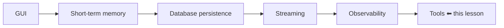
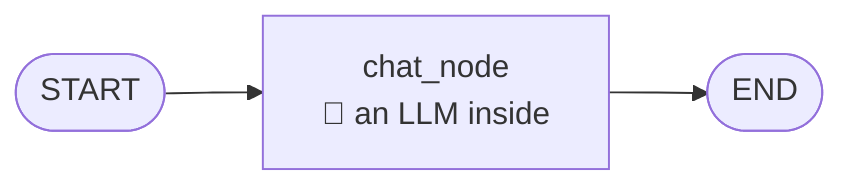
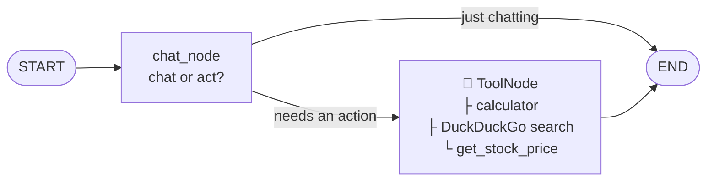
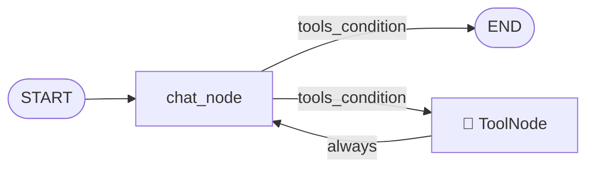

# Adding Tools to a LangGraph Chatbot

> **One-line summary:** Bind your tools to the LLM, drop them into a prebuilt `ToolNode`, let `tools_condition` route between chatting and acting — and then add the one edge everyone forgets, `tools → chat_node`, which turns a dead-end into a loop and is what makes polished answers and multi-step reasoning possible.

---

## Overview

The chatbot so far:



**The problem.** The chatbot is connected to an LLM on the backend, so you can talk to it about anything and get a sensible reply. But it has **no capability to perform actions**. It can discuss; it cannot do.

**Today's fix:** give it **tools**. After this, it won't just chat normally — if you give it a task, it can actually carry that task out.

There's no limit to what you can attach, but since this is a beginner-friendly tutorial, three basic tools:

| Tool | Capability it adds |
|---|---|
| **Calculator** | Perform any numerical calculation |
| **DuckDuckGo search** | Search the internet — currently it can't tell you today's top news in India |
| **Stock price** | Give it a company, get that company's current stock price |

**Demo behaviour to aim for:**

```
"hi"                                    → normal chat mode
"What happened to the Mumbai monorail?" → 🔍 using DuckDuckGo search
"What is the product of 654 and 713?"   → 🧮 using calculator
"Current stock price of Tesla?"         → 📈 using get_stock_price → $323
"Who owns YouTube? Find that company's
 stock price."                          → 🔍 search → "YouTube is owned by
                                          Google" → 📈 stock price
```

That last one is the interesting case: **two tools chained**, where the second tool's input depends on the first tool's output.

**Plan of action — two parts:**
1. **Fundamentals** — how you add tools in LangGraph
2. **Integration** — add those three tools to the existing chatbot project

> ⚠️ **Prerequisite:** this lesson does *not* explain what tools are, or what tool calling is — that's assumed knowledge. The LangChain playlist has a dedicated **Tools** video covering what tools are, why they're used, and how LLMs call them, in detail. Watch that first if the concepts are new.

---

## Part 1 — Fundamentals

### 1. The starting point

The simplest LangGraph workflow you already know:



A question arrives, the LLM looks at it, produces an answer, workflow ends.

### 2. What the requirement forces us to change

Our chatbot wants to do **both** things — hold a normal conversation, *and* get work done when needed. Three changes to the basic workflow.

#### Change 1 — the chat node becomes a decision maker

The simple chat node that only chatted now has to do **additional decision making**. When a question arrives, it reads the content and works out: does the user want **simple chatting**, or do they want **work done**?

| Question | Decision | Route |
|---|---|---|
| *"What is the capital of India?"* | Normal chatting | generate answer → END |
| *"Search the internet and tell me today's top news"* | Needs an action | take the alternate route |

#### Change 2 — the Tool Node

All the tools you want in your system get collected together and put into a **special node** that handles all of them.



**How it works.** The question *"get me today's top news"* arrives. The chat node detects that this isn't chatting, it's an action. Execution flow goes to the ToolNode. The ToolNode **automatically understands which tool to execute**, because the chat node hands it two things:

- the **tool name** — e.g. use the DuckDuckGo search tool
- the **input** for that tool — e.g. `"top news in India today"`

The ToolNode then tells the DuckDuckGo tool to start working with that input, the tool executes, and the answer comes out.

**Formal definition.** In LangGraph, a **ToolNode** is a **prebuilt node** — we didn't build it, LangGraph provides this functionality — that acts as a **bridge between your graph and external tools**. Normally in LangGraph you write a node function yourself: it takes in a state and returns state. A ToolNode is a **ready-made node that knows how to handle a list of LangChain tools**. Its job is to **listen for tool calls**, and the moment it receives one, it automatically **routes that request to the correct tool** and surfaces the tool's response.

In a phrase: the ToolNode is your **tool executor**.

#### Change 3 — `tools_condition`

That branch in the diagram — chat or tools — needs someone to decide. That someone is **`tools_condition`**, an inbuilt LangGraph function used at the chat node.

**Formal definition.** `tools_condition` is a **prebuilt conditional edge function** that helps your graph decide: should the flow go to the **ToolNode**, back to the **LLM**, or to the **END node**?

> 🎯 **Only two new concepts to absorb: `ToolNode` and `tools_condition`.** Get those and the rest of the code is easy.

---

### 3. The code

#### Imports

```python
from langgraph.prebuilt import ToolNode, tools_condition       # ← the two new things
from langchain_community.tools import DuckDuckGoSearchRun      # a prebuilt tool
from langchain_core.tools import tool                          # for custom tools
```

#### Creating the three tools

There are **two kinds of tools** in LangChain:

| | **Prebuilt** | **Custom** |
|---|---|---|
| Who wrote it | LangChain ships it | You, the programmer |
| Why | Common use cases — lots of people need internet search, so they built it | Your specific use case |
| How to use | Just instantiate it | Write a function + `@tool` decorator |
| Example here | `DuckDuckGoSearchRun` | `calculator`, `get_stock_price` |

```python
from dotenv import load_dotenv
from langchain_openai import ChatOpenAI
import requests

load_dotenv()
llm = ChatOpenAI()

# ---------- Tool 1: prebuilt ----------
search_tool = DuckDuckGoSearchRun()


# ---------- Tool 2: custom ----------
@tool
def calculator(first_num: float, second_num: float, operation: str) -> dict:
    """Perform a basic arithmetic operation on two numbers.
    Supported operations: add, sub, mul, div."""
    try:
        if operation == "add":
            result = first_num + second_num
        elif operation == "sub":
            result = first_num - second_num
        elif operation == "mul":
            result = first_num * second_num
        elif operation == "div":
            if second_num == 0:
                return {"error": "Division by zero is not allowed"}
            result = first_num / second_num
        else:
            return {"error": f"Unsupported operation '{operation}'"}

        return {"first_num": first_num, "second_num": second_num,
                "operation": operation, "result": result}
    except Exception as e:
        return {"error": str(e)}


# ---------- Tool 3: custom, hits an external API ----------
@tool
def get_stock_price(symbol: str) -> dict:
    """Fetch the latest stock price for a given symbol
    (e.g. 'AAPL', 'TSLA') using the Alpha Vantage API."""
    url = (f"https://www.alphavantage.co/query"
           f"?function=GLOBAL_QUOTE&symbol={symbol}&apikey=YOUR_KEY")
    r = requests.get(url)
    return r.json()
```

**Notes on the tools:**

- The **calculator** takes three inputs — first number, second number, and which operation to perform between them (plus / minus / multiplication / division) — with an if-else inside producing the output. Very basic code, readable at a glance.
- The **stock price** tool uses **Alpha Vantage**. You need to create your own API key there — it's **free**. Don't reuse someone else's; the daily usage allowance runs out quickly. It simply returns whatever JSON it gets back.

> 🔑 **The docstring rule.** Whenever you build your own tool, you **must** add a docstring describing exactly what that tool does. **The LLM reads it**, and decides on that basis which tool to use for a given problem statement. No docstring, no reliable tool selection.

#### Binding tools to the LLM

```python
tools = [search_tool, calculator, get_stock_price]
llm_with_tools = llm.bind_tools(tools)
```

You're telling the LLM: *look, we have these three tools available.*

#### State — unchanged

```python
class ChatState(TypedDict):
    messages: Annotated[list[BaseMessage], add_messages]
```

Exactly what the chatbot project already had. Nothing different.

#### The two nodes

```python
def chat_node(state: ChatState):
    messages = state["messages"]
    response = llm_with_tools.invoke(messages)      # ← NOT the plain llm
    return {"messages": [response]}


tool_node = ToolNode(tools)        # call the built-in, pass your tools
```

The `chat_node` body is **exactly** what the chatbot project already had, with one difference: it calls **`llm_with_tools`**, not the plain `llm`.

#### The graph

```python
graph = StateGraph(ChatState)
graph.add_node("chat_node", chat_node)
graph.add_node("tools", tool_node)

graph.add_edge(START, "chat_node")
graph.add_conditional_edges("chat_node", tools_condition)

chatbot = graph.compile()
```

If it's a normal workflow → END. If tools are required → the tool node.

---

### 4. Testing it — and finding the flaw

```python
chatbot.invoke({"messages": [HumanMessage(content="hello")]})
# → "Hi there, how can I assist you?"          ← normal workflow

chatbot.invoke({"messages": [HumanMessage(content="What is the product of 2 x 3")]})
# → output from the CALCULATOR tool, not a normal answer

chatbot.invoke({"messages": [HumanMessage(content="What is the stock price of Apple?")]})
# → a JSON blob full of information about Apple's stock
```

The flow works: normal chat takes one route, actions take the other.

> ⏸️ **Pause and think:** is there a problem with this structure, or is it perfect?
>
> **There is a problem. Two, actually.**

### 🚨 Problem 1 — raw, unpolished tool output

We go chat_node → tool_node → END, so whatever the tool produces gets displayed to the user directly. But **tool output isn't refined or polished enough to show a user**.

The Apple stock query returned a **very technical JSON**. A normal user won't understand that. Ideally the answer should read: *"The current stock price of Apple is $X."* But with this structure there's **no option** to present the tool's output in polished form.

### 🚨 Problem 2 — multi-step queries are impossible

Try: *"What is the stock price of Apple? How much would it cost to purchase 50 shares?"*

You get something weird back — first number 50, second number **0**, operation multiplication, result **0**.

What we wanted:

```
Step 1: get Apple's stock price
Step 2: once you have it, multiply by 50 to get the purchase cost
```

That's **two-step thinking** — use one tool, then based on its output use a second tool. But since the flow is chat_node → tool_node → **END**, a two-step or three-step flow **isn't possible at all**.

---

### 5. The fix — make it a loop

Send the tool's output **back to the chat node**.

```python
graph.add_edge("tools", "chat_node")       # ← the one line that fixes everything
```



Conditionally you go either to tools or to END — but from tools you **always**, without exception, go back to the chat node.

#### How this solves Problem 1

```
"2 x 3" → chat_node → calculator → raw result
        → back to chat_node → LLM sees the result, understands it now has
          the answer to what was asked → prints it in refined form → END
```

#### How this solves Problem 2

```mermaid
sequenceDiagram
    participant U as User
    participant C as chat_node
    participant S as get_stock_price
    participant K as calculator

    U->>C: "Apple's stock price? Cost of 50 shares?"
    Note over C: needs Apple's price first
    C->>S: symbol = AAPL
    S-->>C: price data
    Note over C: full history available —<br/>original question, my decision,<br/>what the tool returned
    Note over C: now I have the price;<br/>I should calculate 50 × price
    C->>K: 50, price, "mul"
    K-->>C: result
    Note over C: I now have everything
    C->>U: final polished answer
```

The key phrase is **full history**. Each time control returns to the chat node, it can see what the user originally asked, what it decided, and what the tool reported — and reason from there about whether it's done or needs another tool.

#### Results after the fix

| Query | Before | After |
|---|---|---|
| `2 x 3` | raw tool dict | *"The result of 2 * 3 is 6"* |
| Apple stock price | technical JSON | polished sentence |
| Two-level query | garbage (`result: 0`) | works |

---

### 6. Reading it in LangSmith

Since LangSmith was integrated in the previous lesson (the `.env` already has all the variables), the whole thing can be studied there. Take the trace for *"What is the stock price of Apple?"* — the execution divides into **three parts**:

| Part | What the trace shows |
|---|---|
| **1** | Control goes to **chat_node**. All three tools are listed as available to it. Question in; output: *call `get_stock_price` with input Apple*. Check **`tools_condition`** → its output is **`tools`** → so go from chat node to tool node |
| **2** | Control at the **tool**. `get_stock_price` called with input **AAPL** (Apple's ticker). Output: all the detail returned by the API |
| **3** | Control flows **back to chat_node**. It now holds everything — the original question, its own earlier decision, the tool's response — and produces the final output. Check **`tools_condition`** again → output is **`__end__`** → go to END |

Visualising *when the tool is called* versus *when the LLM is called* is what makes the concept click at a deeper level.

---

## Part 2 — Integrating Into the Chatbot Project

Now that the code makes sense, integration is easy.

### The new backend

A new file in the project folder: **`langgraph_tool_backend.py`** — a rewrite of the old backend where the chatbot's graph lived. Nothing surprising in it; it's everything discussed above plus what the chatbot already had:

```python
# langgraph_tool_backend.py
#  ├── same imports (+ ToolNode, tools_condition, tool, DuckDuckGoSearchRun)
#  ├── load_dotenv()
#  ├── llm = ChatOpenAI()
#  ├── the three tools: search_tool, calculator, get_stock_price
#  ├── tools = [...]  →  llm_with_tools = llm.bind_tools(tools)
#  ├── ChatState  (same as before)
#  ├── chat_node  (same as before, but calls llm_with_tools)
#  ├── tool_node = ToolNode(tools)
#  ├── SqliteSaver checkpointer  (same as before)
#  ├── the graph, with the tools → chat_node loop
#  └── retrieve_all_threads()  (the helper from a past video)
```

### The frontend — two small changes

**No changes needed** to the Streamlit code. Use the file from the last video as-is, with one minor edit:

```python
# change 1: point at the new backend
from langgraph_tool_backend import chatbot, retrieve_all_threads
```

Run it. *"hi"* works. *"What is the product of 2456 and 1234"* gives the output.

### 🚨 The tool-message leak

Ask *"What is the stock price of Apple?"* and you do eventually get the right answer — but **in between, the tool's raw output gets printed/streamed too**.

**Why.** Look at the streaming code in the frontend: whatever message arrives from the backend gets streamed and printed. But behind the scenes **two types of message** are arriving:

| Message type | Sent by | Should it be streamed? |
|---|---|---|
| **`AIMessage`** | The LLM | ✅ Yes |
| **`ToolMessage`** | The tool | ❌ No |

**The fix — change 2:** filter so only `AIMessage`s get streamed.

```python
from langchain_core.messages import HumanMessage, AIMessage      # ← import AIMessage

...

with st.chat_message("assistant"):
    ai_message = st.write_stream(
        message_chunk.content
        for message_chunk, metadata in chatbot.stream(
            {"messages": [HumanMessage(content=user_input)]},
            config=CONFIG,
            stream_mode="messages",
        )
        if isinstance(message_chunk, AIMessage)          # ← the filter
    )
```

Save, rerun, ask *"What is the share price of Tesla?"* — the tool message no longer appears.

**Integration recap:** one new file in the backend; two small changes in the frontend — swap the backend import, and add a filter so streaming happens only for AI messages.

---

### One last touch — the status container

In the opening demo you may have noticed that whenever the chatbot used a tool, a **status container** displayed **which tool** was being used. That's good UX: your user should know at all times whether normal chatting or tool usage is happening — and if it's tool usage, which tool.

- This is **mostly frontend work**.
- On Streamlit's official docs, the chat elements section lists **four** elements. Three are already in use (`chat_message`, `chat_input`, `write_stream`); the fourth is the **status container**.
- The code for it is **a bit difficult / slightly tricky**, so it isn't walked through line by line. Instead there's a **completely new frontend file**, mostly identical except that the last part uses the status container to show updates about which tool is running behind the scenes.
- You can use it directly, or break it down yourself with an LLM's help.

Running it: *"What is the top news in India"* → you see **DuckDuckGo search** appear → then your output.

---

## Comparison Tables

### The two new LangGraph pieces

| | `ToolNode` | `tools_condition` |
|---|---|---|
| What it is | A prebuilt **node** | A prebuilt **conditional edge function** |
| Where it goes | `graph.add_node("tools", ToolNode(tools))` | `graph.add_conditional_edges("chat_node", tools_condition)` |
| Its job | Listen for tool calls, route to the correct tool, return the response | Decide: ToolNode, back to the LLM, or END |
| Do you write it? | No — LangGraph provides it | No — LangGraph provides it |
| Analogy | The tool **executor** | The **router** |

### Prebuilt vs custom tools

| | Prebuilt | Custom |
|---|---|---|
| Source | LangChain | You |
| Setup | `DuckDuckGoSearchRun()` | `@tool` decorator on a function |
| Docstring required? | Already has one | **Yes — mandatory** |
| Example | Internet search | Calculator, stock price |

### The graph, before and after the loop

| | `chat → tools → END` | `chat ⇄ tools`, `chat → END` |
|---|---|---|
| Tool output shown to user | Raw JSON / dicts | Polished natural language |
| Multi-step tool chains | ❌ Impossible | ✅ Works |
| Who formats the answer | Nobody | The LLM, on the return trip |
| What the LLM sees on return | n/a | Full history — question, decision, tool result |
| Code difference | — | one line: `graph.add_edge("tools", "chat_node")` |

### Message types reaching the frontend

| Type | Origin | Stream it? | How to filter |
|---|---|---|---|
| `HumanMessage` | The user | n/a | — |
| `AIMessage` | The LLM | ✅ | `isinstance(chunk, AIMessage)` |
| `ToolMessage` | A tool | ❌ | excluded by the same check |

---

## Common Pitfalls / Gotchas

1. **Forgetting the `tools → chat_node` edge.** The single most consequential omission. Everything appears to work — tools fire, answers come back — but the output is raw and multi-step queries silently produce nonsense.

2. **Calling the plain `llm` inside `chat_node`.** It must be **`llm_with_tools`**. The plain model has no idea the tools exist and will never emit a tool call.

3. **Omitting the docstring on a custom tool.** The LLM reads the docstring to decide which tool fits the problem. Without it, tool selection becomes unreliable.

4. **Reusing someone else's Alpha Vantage key.** It's free to create your own, and the daily usage allowance runs out fast.

5. **Streaming every message type.** `ToolMessage` output leaks into the chat window alongside the answer. Filter with `isinstance(chunk, AIMessage)` — and remember to **import `AIMessage`**.

6. **Forgetting to repoint the frontend import.** The backend filename changed to `langgraph_tool_backend`; the old import will keep loading the tool-less backend and you'll wonder why nothing calls a tool.

7. **Judging the feature by demo search quality.** In the walkthrough, DuckDuckGo returned poor results for a couple of queries. The *tool* was working; the *results* were weak. Don't confuse a bad answer with a broken integration.

8. **Expecting this lesson to teach tool calling.** It assumes you know what tools are and how LLMs call them — that's the LangChain playlist's Tools video.

9. **Assuming the ToolNode needs custom routing logic.** It automatically works out which tool to run, because the LLM supplies both the **tool name** and the **input**.

10. **Passing tools to `ToolNode` but forgetting `bind_tools`** (or vice versa). Both are needed: `bind_tools` tells the *LLM* what exists; `ToolNode(tools)` tells the *graph* how to execute them.

---

## Key Concepts Worth Remembering

- **The gap being closed:** the chatbot could converse but not **act**. Tools give it the ability to perform work.
- **Three tools added:** calculator (custom), DuckDuckGo search (prebuilt), stock price (custom, external API).
- **The chat node becomes a decision maker** — reads the question and decides: chat, or act?
- **`ToolNode` is a prebuilt node** that bridges your graph and external tools. It listens for tool calls and routes each to the correct tool. It's your **tool executor**.
- **`tools_condition` is a prebuilt conditional edge function** that decides between the ToolNode, the LLM, and END.
- **Two tool types:** prebuilt (LangChain ships them) and custom (`@tool` decorator).
- **Always write a docstring on a custom tool** — the LLM reads it to choose tools.
- **`llm.bind_tools(tools)`** tells the model what's available; `chat_node` must call **`llm_with_tools`**.
- **`graph.add_edge("tools", "chat_node")` is the critical line.** Without the loop you get raw output and no multi-step reasoning.
- **The loop works because of history** — on the return trip the chat node sees the original question, its own decision, and the tool's result, and can decide whether to call another tool or answer.
- **In LangSmith,** `tools_condition` outputs `tools` on the way in and `__end__` on the way out — a clean way to watch the routing.
- **Backend gets a new file; frontend needs two lines changed** — the import, and the `AIMessage` filter.
- **`AIMessage` gets streamed, `ToolMessage` does not.**
- **The status container** is Streamlit's fourth chat element, used to show which tool is running.
- **Homework:** add a tool of your own choosing.

---

## Summary

Tools are what turn a chatbot from something that talks into something that acts. In LangGraph the addition rests on two prebuilt pieces: a **`ToolNode`**, which holds a collection of tools and automatically routes each incoming tool call to the right one, and **`tools_condition`**, a prebuilt conditional edge that decides whether execution should head for the tools or straight to the end. Around them you write very little — the chat node keeps the same body it always had, except that it invokes `llm_with_tools` instead of the bare model, and custom tools are just decorated Python functions whose **docstrings** are what the LLM reads when choosing between them.

The instructive part is the flaw in the obvious design. Wiring `chat_node → tools → END` produces something that appears to work but hands the user raw JSON and collapses entirely on any query needing two tools in sequence — asking for Apple's price and then the cost of fifty shares returns a multiplication by zero. The cure is a single edge, `tools → chat_node`, which converts the dead-end into a loop. Now every tool result returns to the LLM, which holds the full conversation history and can either polish the result into a sentence or recognise that it needs to call another tool with what it just learned. LangSmith makes the whole cycle legible: `tools_condition` reports `tools` on the way in and `__end__` on the way out.

Folding this into the existing chatbot took one new backend file and two frontend lines — repointing the import, and filtering the stream so only `AIMessage` chunks are rendered, since `ToolMessage` output would otherwise leak into the chat window. A Streamlit **status container** finishes the job by telling the user which tool is running, so the experience stays transparent rather than mysterious. With tools in place, the roadmap ahead — RAG, MCP — becomes much more approachable.
