# LangSmith — Observability & Evaluation for LLM Applications

> **One-line summary:** LangSmith turns your LLM application from a black box into a white box — set three environment variables and every execution is traced component by component, with inputs, outputs, latency, tokens, and cost visible at every step, which is the only practical way to debug latency spikes, cost spikes, and hallucinations in non-deterministic systems.

---

## Table of Contents

1. [Why LangSmith Exists — Three Scenarios](#1-why-langsmith-exists--three-scenarios)
2. [The Common Thread: Non-Determinism](#2-the-common-thread-non-determinism)
3. [Observability & What LangSmith Is](#3-observability--what-langsmith-is)
4. [What LangSmith Traces](#4-what-langsmith-traces)
5. [Setup](#5-setup)
6. [Core Concepts: Project, Trace, Run](#6-core-concepts-project-trace-run)
7. [Example 1 — Simple LLM Call](#7-example-1--simple-llm-call)
8. [Example 2 — Sequential Chain (tags, metadata, names)](#8-example-2--sequential-chain-tags-metadata-names)
9. [Example 3 — RAG (and its two problems)](#9-example-3--rag-and-its-two-problems)
10. [Example 4 — Agents](#10-example-4--agents)
11. [LangSmith + LangGraph](#11-langsmith--langgraph)
12. [Beyond Observability — Six More Capabilities](#12-beyond-observability--six-more-capabilities)
13. [Comparison Tables](#13-comparison-tables)
14. [Common Pitfalls](#14-common-pitfalls)
15. [Key Concepts Worth Remembering](#15-key-concepts-worth-remembering)
16. [Summary](#16-summary)

**Prerequisites:** LangChain fundamentals, and LangGraph fundamentals.

---

## 1. Why LangSmith Exists — Three Scenarios

Three real-world stories, each showing a different failure mode you cannot debug without observability.

### Scenario 1 — The Cover Letter Generator (LLM workflow) → **LATENCY**

**The product.** A startup noticed that graduating students job-hunt like this: go to a job site, filter jobs, study the JD, tailor the résumé and cover letter to it, apply. And they repeat that 10+ times a day, because sending the same generic cover letter everywhere signals no effort.

So the team built an LLM app:

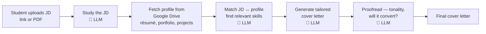

**The failure.** Normal latency was about **2 minutes**. One day the support inbox fills up: the site is slow. The same job now takes **7–10 minutes**. Users get impatient and leave the platform. That's revenue loss.

**Why it's hard to debug.** This is a complex, multi-stage workflow with LLM calls at four different points. All you have is:

- what the user put in,
- what came out,
- and the **total** time.

You have no per-stage breakdown. How long did reading the JD take? Fetching documents? Matching? You don't know which of the eight extra minutes belongs to which component.

**The (hypothetical) culprit.** The last release accidentally shipped code that scans the **entire Google Drive** instead of one specific folder. Plausible — but without stepping inside the system you cannot pin the delay on the document-fetching stage.

---

### Scenario 2 — The Research Assistant (agent) → **COST**

**The product.** A researcher types a topic (say, *solar energy*):

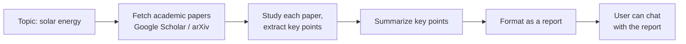

**The economics.** Roughly **50 paise per report** in token costs. Pricing to users was set against that margin.

**The failure.** The OpenAI dashboard cost suddenly climbs. Breaking it down: some reports still cost 50 paise, but others cost **₹2**. At scale — many users, every day, every month — that gap destroys the margin. Users are the same, revenue is the same, cost quadruples on a subset. Straight into loss.

**Why it's hard to debug.**

- Agents are **autonomous**: you give a goal, they reason, act, check whether the goal is met, and loop.
- The error isn't consistent — sometimes it happens, sometimes it doesn't.
- **Nothing crashed**, so there's no error trace anywhere.
- Multiple stages, and no idea which one is burning money.

**The (hypothetical) culprit.** A minor prompt change in the last upgrade: *keep generating the report until it's really good.* Now, if the agent judges the report's quality as insufficient, it repeats the **entire** pipeline — search, download, study, extract, summarize, evaluate. For some topics it's satisfied first time (50 paise); for others it becomes a perfectionist and loops (₹2). One or two sentences of prompt, written to *improve* user experience, changed the agent's behaviour — and only sometimes.

---

### Scenario 3 — The HR Chatbot (RAG) → **HALLUCINATION**

**The product.** A huge organisation with lakhs of employees and thousands of freshers joining each year. Rules everywhere — leave policy, notice period, health insurance. Freshers ask HR the same questions daily; HR complains their productivity is suffering.

Solution: gather company documents into a knowledge base and put a RAG chatbot in front of it.

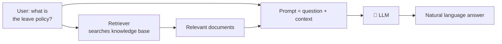

**The failure.** Teammates complain the chatbot has started **hallucinating** — inventing answers rather than giving factual ones, and spreading misinformation through the company. An employee asks about the leave policy; the bot cheerfully says take leave whenever you like, go to Goa. The employee packs a bag and goes. Whose fault? The company's chatbot said so. Now imagine the same failure on notice period or salary questions.

**Why it's hard to debug.** A RAG system hallucinates for essentially two reasons:

| Failure point | What went wrong | Example culprit |
|---|---|---|
| **Retriever error** | The question was read, but the wrong chunks came back | `k` (number of retrieved docs) was set to **1** in the last upgrade — too few. A question about notice period pulls back documents about company history. Should probably be 3 or 5. |
| **Generator error** | Good chunks retrieved, but the LLM still hallucinated | A low-quality local model; an upstream provider upgrade that changed answer quality; or a **lenient prompt** that doesn't strongly enforce answering only from context |

The right prompt pattern is: *answer only from the given context; if the context doesn't contain enough information, simply say you don't know.* If a teammate softened that, the LLM will improvise whenever the context looks thin.

But with only the final response visible, you can't tell **which** of the two failed. You can't see which documents the retriever fetched, and you can't see what the final assembled prompt actually looked like.

---

## 2. The Common Thread: Non-Determinism

All three are LLM-based systems, and the hardest property of LLM systems is that their behaviour is **non-deterministic**.

| | Ordinary software | LLM-based system |
|---|---|---|
| Same input → | **Always** the same output | **Different** outputs |
| Example | A calculator: 2 × 4 = 8, a thousand times out of a thousand | The same prompt can produce different responses |
| Failures leave | Stack traces, exceptions | Often **nothing** — no crash, no error trace |
| Explainability | Readable code paths | A black box |

That combination — non-deterministic, complex, no error trace, no explainability — is precisely why latency, cost, and hallucination problems are so painful to debug once deployed in production.

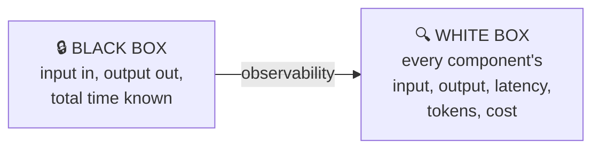

---

## 3. Observability & What LangSmith Is

### Observability

The idea, in the standard definition's terms: it's the ability to understand a system's **internal state** by examining its **external outputs** — logs, metrics, and traces — so you can diagnose issues, understand performance, and improve reliability. The key phrase is that it lets you answer **why** something is happening inside a system, **even if you never anticipated that problem**.

In practice: use a tool to open up your system's internals and see, **component by component**, what each part is doing. You execute the application once, **trace it end to end**, and that trace is stored somewhere you can revisit at any time to find where things went wrong.

### LangSmith

LangSmith describes itself as a **unified observability and evaluation platform** where teams can debug, test, and monitor AI application performance.

In plain terms: it's the tool that brings observability into your LLM application. You run your app, and LangSmith traces the whole execution component by component — showing what each component received, what it produced, and how long it took. **Everything recorded at a very granular level.**

---

## 4. What LangSmith Traces

| What | Detail |
|---|---|
| **Inputs & outputs** | Of the whole execution — what the user asked, what the app answered |
| **All intermediate steps** | E.g. in RAG: the retriever's question, the retrieved context, the assembled prompt, the LLM's generation, what the output parser saw |
| **Latency** | Not just at application level but **per component** |
| **Token usage** | Input tokens and output tokens |
| **Cost** | Computed from the model you're using |
| **Errors** | Whether any component errored |
| **Tags** | Your own custom tags, plus system-generated ones — LangSmith is smart enough to tag a trace with the model name automatically |
| **Metadata** | Custom metadata you attach, plus system metadata (e.g. LangChain version, dependencies) |
| **User feedback** | Optionally attached to the trace |

---

## 5. Setup

```bash
# 1. Clone the repo of examples
git clone <repo-url>

# 2. Open the folder in VS Code, then:
python -m venv myenv
source myenv/bin/activate          # myenv\Scripts\activate on Windows

# 3. Install dependencies
pip install -r requirements.txt
```

**4. Create a LangSmith account** on the LangSmith site → sign up / log in.

**5. Generate an API key:** Settings → the **+** button → add a description (e.g. "personal project") → key type **Personal Access Token** → set an expiry → **Create API Key** → copy it.

**6. Create a `.env` file:**

```bash
OPENAI_API_KEY=sk-...

LANGCHAIN_TRACING_V2=true                          # must be true, or nothing is traced
LANGCHAIN_ENDPOINT=https://api.smith.langchain.com
LANGCHAIN_API_KEY=lsv2_...                         # the key you just copied
LANGCHAIN_PROJECT=LangSmith Demo                   # creates a project with this name
```

| Variable | Purpose |
|---|---|
| `LANGCHAIN_TRACING_V2` | The master switch. **Must be `true`** |
| `LANGCHAIN_ENDPOINT` | Where traces are sent |
| `LANGCHAIN_API_KEY` | Your LangSmith key |
| `LANGCHAIN_PROJECT` | A project with this name is created on LangSmith; all tracing lands there |

> ⚠️ Rotate or delete keys that have been exposed — including in screen recordings or committed files.

---

## 6. Core Concepts: Project, Trace, Run

Three terms you'll see constantly. Take a simple LLM app: user asks a question → prompt → LLM → parser → answer shown.

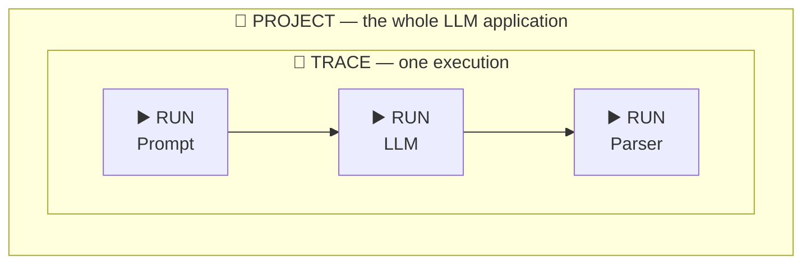

| Concept | Definition | In this example |
|---|---|---|
| **Project** | The entire LLM application | The whole question-answering app |
| **Trace** | **One single execution** of the project | User asks "What is the capital of India?" → the app runs end to end → that's one trace |
| **Run** | The execution through **one component** | Three runs: prompt, LLM, parser |

Run it a second time for a different user → a second trace, again with three runs.

**Navigation in the UI mirrors this:** Tracing Projects → your project → its traces → each trace's runs.

---

## 7. Example 1 — Simple LLM Call

```python
from langchain_core.prompts import PromptTemplate
from langchain_openai import ChatOpenAI
from langchain_core.output_parsers import StrOutputParser
from dotenv import load_dotenv

load_dotenv()

prompt = PromptTemplate.from_template("{question}")
model = ChatOpenAI()
parser = StrOutputParser()

chain = prompt | model | parser

result = chain.invoke({"question": "What is the capital of Peru?"})
print(result)      # The capital of Peru is Lima.
```

**The magic of LangSmith:** you change **nothing** in your code. Because the endpoint and API key are already in the `.env`, running this automatically traces the entire execution.

### What you see in the UI

- **Tracing Projects** now lists two projects: **default** (auto-created) and **LangSmith Demo** (the name from your `.env`).
- Click the project → your traces, one per execution, with start times.
- The trace row shows: **input**, **output**, whether there was an **error**, **latency**, **token count**, and **cost**.
- Click the trace → a detailed overview of all component runs: `PromptTemplate`, `ChatOpenAI`, `StrOutputParser`.
- Click any run → that component's input and output, plus its own latency (e.g. `ChatOpenAI` took 1.11 seconds).

Change the question and rerun → a second trace appears alongside the first.

---

## 8. Example 2 — Sequential Chain (tags, metadata, names)

A two-step app: generate a detailed report on a topic, then produce a five-point summary of that report.

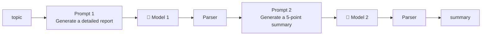

### Change 1 — set the project name from code

Each distinct application deserves its own LangSmith project. Two ways to do it: edit the `.env`, or set it **inside the code**:

```python
import os
os.environ["LANGCHAIN_PROJECT"] = "Sequential LLM App"
```

The `.env` is read first, but the code assignment **overrides** it.

### Change 2 — specify models explicitly

```python
model1 = ChatOpenAI(model="gpt-4o-mini", temperature=0.7)   # report generation
model2 = ChatOpenAI(model="gpt-4o",      temperature=0.5)   # summarization
```

### Change 3 — custom tags, metadata, and run name

Attach a `config` dictionary where you invoke the chain:

```python
config = {
    "run_name": "sequential-chain",                     # replaces "RunnableSequence"
    "tags": ["llm-app", "report-generation", "summarization"],
    "metadata": {
        "model1": "gpt-4o-mini",
        "model1_temp": 0.7,
        "parser": "StrOutputParser",
    },
}

result = chain.invoke({"topic": "unemployment in India"}, config=config)
```

| Config key | Effect in the UI |
|---|---|
| `run_name` | Replaces the auto-generated top-level name |
| `tags` | A list of labels shown on the trace, filterable |
| `metadata` | A dict of key–value details shown on the trace |

### What you see

- A **new project** appears in Tracing Projects.
- The trace carries your **tags** and **metadata** — alongside system-generated metadata.
- Runs are organised in order: `PromptTemplate` → `ChatOpenAI (gpt-4o-mini)` → `StrOutputParser` → `PromptTemplate` → `ChatOpenAI (gpt-4o)` → `StrOutputParser`. The model name appears as a label.
- **Runs have their own tags too** — e.g. sequence step 1, step 2, step 5 — auto-generated by LangSmith.
- **Metadata exists at both levels:** what you set in `config` appears at the **trace** level; each `ChatOpenAI` run carries its own model metadata. LangSmith logs some things on its own initiative.

---

## 9. Example 3 — RAG (and its two problems)

### Why LangSmith + RAG is a strong pairing

RAG means giving the LLM a query **plus additional context** so it can answer over your private data. Theoretically simple; in production, most people complain their RAG chatbot's answer quality isn't good enough — and the cause is either a **retriever error** or a **generator error** (see Scenario 3).

The production problem is that a bad response gives you nothing to deduce from. You only see the final answer; there are no intermediates.

LangSmith traces every intermediate step: the user's question, the documents the retriever fetched, the assembled prompt (question + context), and the LLM's final response. Locating the failure becomes easy.

### v1 — the baseline app

The PDF sits in the project directory: *An Introduction to Statistical Learning* — a machine learning book, **441 pages**.

```python
import os
os.environ["LANGCHAIN_PROJECT"] = "RAG Chatbot"

# Step 1 — load
loader = PyPDFLoader(PDF_PATH)
docs = loader.load()

# Step 2 — chunk
splitter = RecursiveCharacterTextSplitter(chunk_size=1000, chunk_overlap=150)
chunks = splitter.split_documents(docs)

# Step 3 — embed + retriever
vectorstore = FAISS.from_documents(chunks, OpenAIEmbeddings(model="text-embedding-3-small"))
retriever = vectorstore.as_retriever()

prompt = ChatPromptTemplate.from_messages([
    ("system", "Answer only from the provided context. If not found, say you don't know."),
    ("human", "Question: {question}\nContext: {context}"),
])

def format_docs(docs):
    # merge the text of all retrieved Document objects into one big string
    return "\n\n".join(d.page_content for d in docs)

parallel = RunnableParallel({
    "question": RunnablePassthrough(),
    "context": retriever | RunnableLambda(format_docs),
})

chain = parallel | prompt | llm | StrOutputParser()
```

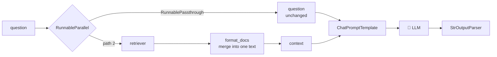

Ask *"Who is the author of this book?"* → correct author names come back. In LangSmith, a new **RAG Chatbot** project appears, and the trace beautifully mirrors the chain: `RunnableSequence` at the top → `RunnableParallel` with its two paths → `ChatPromptTemplate` (inputs: context + question) → `ChatOpenAI` → `StrOutputParser`, with latency and tokens on every node.

### 🚨 Problem 1 — the whole app is NOT traced

Only the **chain execution** is traced. The part that loads the PDF, chunks it, and embeds it — an equally important part of the RAG application — doesn't appear anywhere. There's no mention of PDF loading, chunking, or embedding in the trace.

**Why:** by default LangSmith only traces **LangChain runnables** — anywhere `invoke` is being implemented. Loading, chunking, and embedding used no runnables, so nothing was traced there.

Ideally you'd want end-to-end tracing: how long the PDF took to load, how long chunking took, how long embedding took, which embedding model was used.

### 🚨 Problem 2 — a logical flaw

**Every single run reloads the PDF, re-chunks it, and regenerates the embeddings.** So every query takes the same long time (~202 seconds in the demo). What should happen: build once on the first run, store it, and on every subsequent run go straight to the stored embeddings.

---

### v2 — fixing Problem 1 with `@traceable`

```python
from langsmith import traceable

@traceable(name="load_pdf", tags=["pdf", "loader"],
           metadata={"loader": "PyPDFLoader"})
def load_pdf(path):
    return PyPDFLoader(path).load()


@traceable(name="split_documents")
def split_documents(docs, chunk_size, chunk_overlap):
    splitter = RecursiveCharacterTextSplitter(chunk_size=chunk_size,
                                              chunk_overlap=chunk_overlap)
    return splitter.split_documents(docs)


@traceable(name="build_vector_store", tags=["embedding", "vectorstore"],
           metadata={"embedding_model": "text-embedding-3-small"})
def build_vector_store(docs):
    vs = FAISS.from_documents(docs, OpenAIEmbeddings(model="text-embedding-3-small"))
    return vs.as_retriever()


@traceable(name="setup_pipeline")
def setup_pipeline(path):
    docs = load_pdf(path)
    chunks = split_documents(docs, 1000, 150)
    return build_vector_store(chunks)
```

Plus a cosmetic run name on the query side:

```python
chain.invoke(question, config={"run_name": "pdf_rag_query"})
```

**What `@traceable` does:** it lets you trace **any normal Python function**, even one containing no runnables at all. The `name` argument is what appears as the run name in the UI.

**What you now see:** two traces are created —

| Trace | Contains |
|---|---|
| `setup_pipeline` | Three runs: `load_pdf`, `split_documents`, `build_vector_store` |
| `pdf_rag_query` | The parallel chain + prompt + LLM + parser, exactly as before |

Drilling into `setup_pipeline`:

- **load_pdf** — input: the path. Output: a set of Documents, **one per page** → 441 document objects for a 441-page book. Latency: ~15 seconds.
- **split_documents** — input: chunk size and chunk overlap. Splitting is fast.
- **build_vector_store** — input: the 441 documents. Output: a retriever object. Takes noticeable time.

**Component-level tags and metadata** (as shown above) also become **searchable**: click a metadata value and find every trace that used that particular embedding model. That's the main point of tagging when you have a lot of traces.

### 🚨 The remaining structural issue

It's traced as **two separate traces**, when it is one single application. The desired hierarchy is:

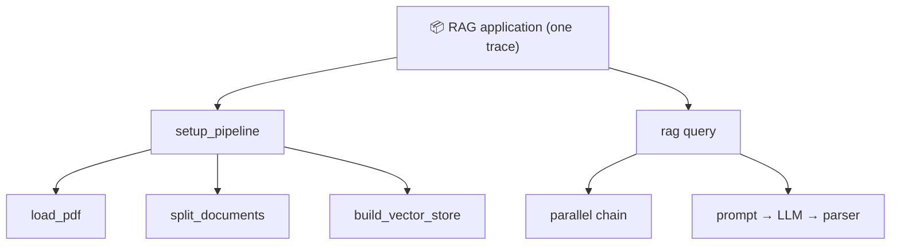

Right now the app behaves as though it were made of two separate applications, which isn't a good idea.

---

### v4 — fixing Problem 2 (latency) with a persisted index

> The video is candid here: this code is a bit difficult and isn't explained line by line, because the goal of the lesson is understanding LangSmith, not writing the best possible RAG code.

**The core change:** use **FAISS** as the vector database, and write the code so that the first run **builds an index** in the project directory (the document's embeddings). Every subsequent run first checks whether that index already exists:

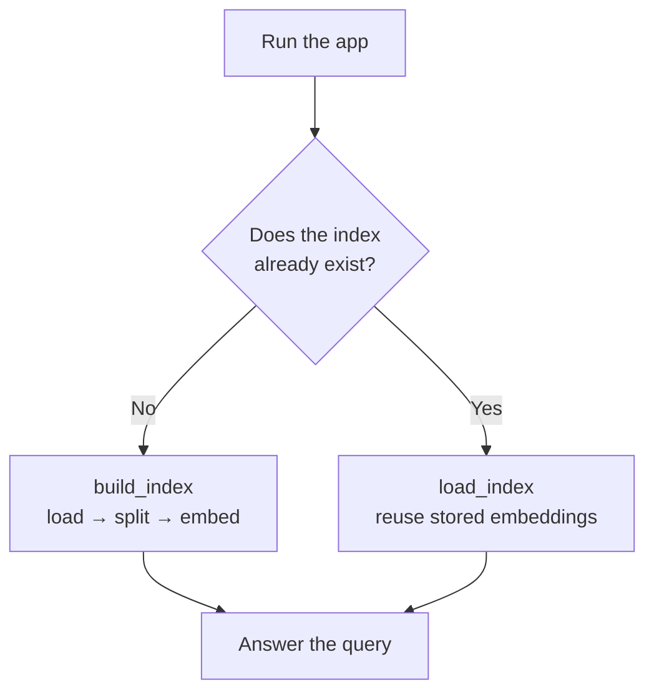

**Observed results:**

| Run | Trace shows | Latency |
|---|---|---|
| 1st (index absent) | `setup_pipeline` → **`build_index`** → load_pdf, split_documents, build_vector_store | ~30 s |
| 2nd | `setup_pipeline` → **`load_index`** — output is directly the stored index | **1.65 s** |
| 3rd | `load_index` again | 4.42 s (more documents retrieved) |

Compared to **202 seconds** before. The `.index` files in the project folder hold all the embeddings; every subsequent run reuses rather than recreates them.

**When does the index get rebuilt rather than reused?**

| # | Condition |
|---|---|
| 1 | First run / the index isn't available |
| 2 | The PDF's **content** changes (a different PDF, path updated) |
| 3 | The PDF's **metadata** changes — file size or last modification time |
| 4 | **Chunking parameters** change — `chunk_size` or `chunk_overlap` |
| 5 | A **different embedding model** is used |

Outside those cases the existing index answers every query, so the application stays fast. **This is what you do in production:** maintain an index and answer from it repeatedly, rather than redoing the same work each time.

---

## 10. Example 4 — Agents

A ReAct agent with two tools: **DuckDuckGo search** and a **weather tool**.

### The ReAct loop, as LangSmith shows it

Collapse the trace and there are three high-level components per cycle:

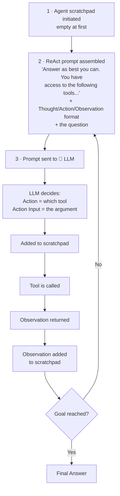

### Query 1 — a movie release date

The agent searched and produced a release date that was **wrong** — the film had already released. A useful reminder that agents confidently produce incorrect answers, and that observability is how you catch it.

### Query 2 — "What is the current temperature of Gurgaon?"

Forces the weather tool. The trace walks through: scratchpad initiated → prompt template with the question → LLM responds that it should use the weather function, Action = `get_weather_data`, Action Input = Gurgaon → added to scratchpad → tool called → the API returns a lot of data (humidity, wind speed — **everything gets recorded**) → all of it appended to the scratchpad → prompt template refilled with the full scratchpad → LLM → final answer, 30°C.

### Query 3 — two tools chained

*"Identify the birthplace of Kalpana Chawla and then give its current temperature."* This forces **both** tools.

| Step | What the trace shows |
|---|---|
| 1 | Log: first search for the birthplace, then get that city's temperature. Action + Action Input set |
| 2 | DuckDuckGo search for the birthplace city — returns details about several different people with that name |
| 3 | All of it added to the scratchpad |
| 4 | Log: now that the birthplace is known to be Karnal, get Karnal's current temperature. Action = `get_weather_data`, Action Input = Karnal |
| 5 | Weather API returns data |
| 6 | Final log: the current temperature in Karnal is 27°C → **Agent Finish** → Final Answer |

*(Note: a first attempt picked the wrong city because the question hadn't been pasted correctly — worth remembering that "the agent got it wrong" is sometimes "the input was wrong.")*

**The payoff:** enormous transparency into a process that is still autonomous. You observe every intermediate state, see how each step's output becomes the next step's input, watch the Thought/Action/Observation pattern play out, and check total tokens, cost, and latency from the top view.

**Recommendation from the video:** whenever you build agentic applications, integrate LangSmith.

---

## 11. LangSmith + LangGraph

### Why it matters

LangGraph treats LLM applications as **workflows** representable as **graphs** — with state, nodes as tasks, and edges telling you which task runs after which. The problem: once workflows get even slightly complex, the graph becomes complex and difficult, and debugging it is hectic **because the structure itself is complex**.

LangSmith has a very strong integration with LangGraph, because **both products are built by the same team** — they're tightly coupled.

### The two concepts to remember

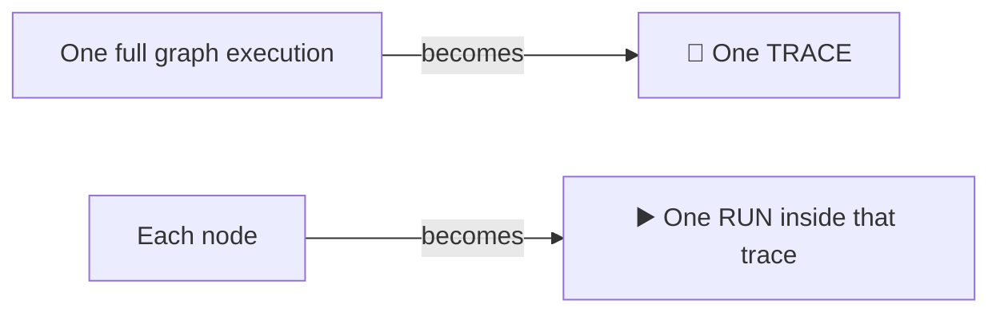

- A graph with 5 nodes → 5 components/runs in the LangSmith UI.
- You can **visualise which path was taken** during the execution.
- **Branching** — conditional, parallel — and **subgraphs** are captured too.

So however complex your LangGraph graph is, LangSmith lets you track it easily.

### The example: a UPSC essay checker

Input an essay; judge it on three parameters — **language**, **analysis**, and **clarity of thought**. Each produces a feedback and a score. Then a final node produces an overall feedback summary and the average score.

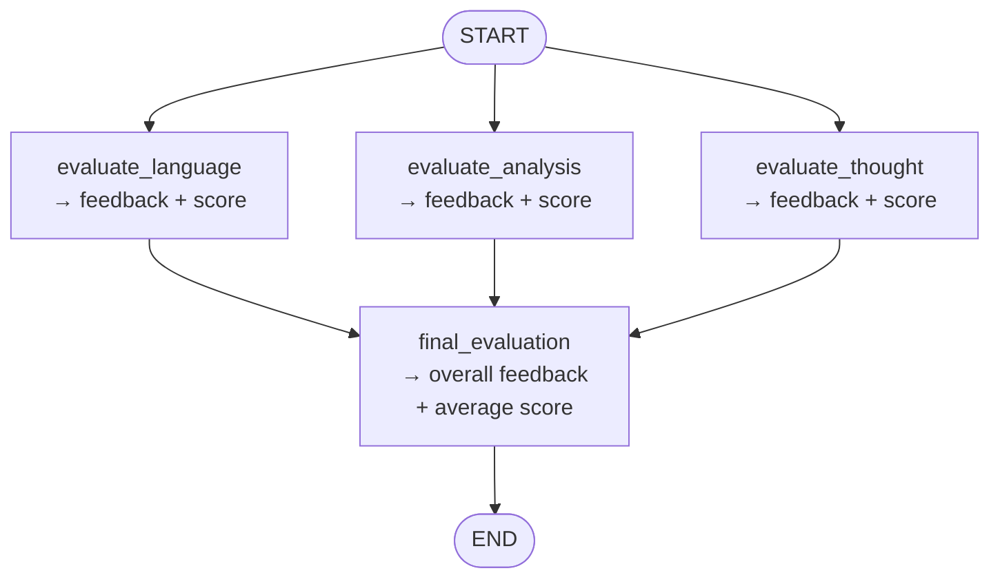

**An optional extra:** even though LangSmith tracks all nodes automatically, `@traceable` decorators were added on **each node's function** as well. So both the node and the function inside the node get traced. This step is optional — remove the `traceable` lines and nothing breaks — but it enables tracing at the function level.

```python
os.environ["LANGCHAIN_PROJECT"] = "LangGraph Essay Checker"

@traceable(name="evaluate_analysis")
def evaluate_analysis(state: EssayState):
    ...

config = {"run_name": "Evaluate UPSC Essay", "tags": [...], "metadata": {...}}
workflow.invoke(initial_state, config=config)
```

### What the trace reveals

- New project **LangGraph Essay Checker**, trace named **Evaluate UPSC Essay** (from `run_name`).
- Collapsed view: the three evaluation nodes execute **in parallel**, and their outputs flow into `final_evaluation`.
- Open the first node → you see the function `evaluate_analysis` (thanks to `@traceable`). Its **input is the entire state** — exactly as in LangGraph, where every node function receives the state — and its output is the node's return value.
- Inside that: a **RunnableSequence**. Input is the essay; output follows a **schema** with a feedback value and a score value.

**Why a schema?** Because that node uses a **structured-output LLM**:

```python
structured_model = model.with_structured_output(EvaluationSchema)
```

The LLM call is forced to follow the schema — return exactly two things, feedback and score. A **RunnableLambda** then takes the LLM's response and arranges it according to the output schema.

- The second and third nodes work identically — function taking state, RunnableSequence, structured LLM following the schema.
- The **final node** receives a state that now contains analysis feedback, clarity feedback, language feedback, and all the individual scores, and generates two things: the overall feedback summary and the average score. Its LLM call is a **normal, unstructured** model, so **no RunnableSequence or RunnableLambda appears** there — those only show up when you have a structured-output LLM. It's very simple by comparison.
- **Per-node latency and cost** are visible (e.g. the `evaluate_analysis` node took 3.5 seconds).

**Practical recommendation:** integrate LangSmith whenever building complex LangGraph workflows. Beyond debugging, it's also a strong **learning tool** — it helps you understand how the whole graph actually functions.

---

## 12. Beyond Observability — Six More Capabilities

Everything so far was one perspective: observability. LangSmith does more.

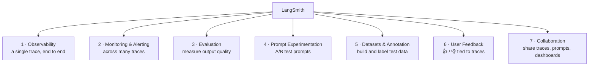

### 2. Monitoring & Alerting

**Observability studies a single trace. Monitoring studies many traces together.**

Monitoring aggregates key metrics across traces — latency, token usage, cost, error rates, success rates — and lets you set alerts when those metrics drift outside acceptable ranges.

Your app runs many times a day. Monitoring answers: across all of today's traces, what was the average latency? Average token usage? Average cost? If latency starts climbing, you can act immediately.

**In the UI:** below Tracing Projects there's **Monitoring**. Select a project and you get graphs for:

| Graph | Tells you |
|---|---|
| Traces per day | Usage curve |
| Trace latency | Response time trend |
| Trace error rate | Reliability |
| Total LLM calls | Call volume |
| LLM call latency | Model-level speed |
| Cost & tokens | Spend trend |
| Cost per trace | Unit economics |
| Input / output tokens, and per trace | Token breakdown |
| Tool usage | Which tools are firing |

**Alerts:** inside Monitoring there's an alerts option. Pick a project, create a custom alert on a metric you want to track, define the limit, and if it's breached an alert is raised — e.g. *latency > 5 seconds → alert the team* so someone can debug immediately and bring it back within normal limits.

**Why it matters:** in production, issues usually appear first as **patterns across multiple runs** rather than in a single trace. One slow trace could be a one-off. But the same pattern repeating over a period of time is the signal you need to catch. Monitoring catches these early signals **before they impact users at scale** — instead of waiting for customer complaints, you're proactively alerted when performance degrades or cost spikes.

Imagine your production app silently developing a latency or cost problem and you never finding out. That's the danger monitoring removes.

### 3. Evaluation

LLMs are probabilistic, so the same input can give different outputs. Change one small thing — tweak a prompt, swap model A for model B, use a different retriever — and the input stays the same while the output shifts considerably.

Evaluation gives you an **objective, repeatable** way to track performance over time — ensuring new versions are actually better and **preventing regressions**. Without it, when you push an upgrade, how do you know it's better than the previous version? It might be worse.

**LangSmith supports:**

- Running tests against **gold-standard datasets**
- **Custom evaluation metrics** such as faithfulness, relevance, and completeness
- Multiple approaches: **automated scoring with LLM-as-a-judge**, semantic similarity checks, or **custom Python evaluators**
- Both **online** and **offline** evaluation

**In the UI:** Tracing Projects → a project → **Evaluators** tab → set up an evaluator. You can use your own data, build data from scratch, write your own functions, or use **prebuilt evaluators** — e.g. a hallucination check, a conciseness check, a code checker.

### 4. Prompt Experimentation

Prompting matters enough that an entire field grew around it. How much performance you extract from an LLM depends heavily on how well your prompt is written — critical when building chatbots, RAG systems, and agents.

**The problem:** given prompt A and prompt B, how do you know which is better? Running each once in a chat interface gives you **no conclusive evidence**. You need to plan systematically.

**Prompt experimentation** means taking a dataset and testing your prompt on it against evaluation criteria — essentially **A/B testing prompts**. LangSmith lets you run A/B tests across prompts on the same dataset, track their performance against evaluation metrics, and record the outcomes. Results are stored over time, giving you a clear history of which prompt variations worked best and **under what conditions**.

**In the UI:** **Prompt Engineering** → **Playground** → hit **Compare**. Set up your prompt, provide a schema, define evaluation criteria. You can also **test models** — run the same prompt against two different models to see which gives the best result.

**Prompt versioning:** you can store prompts in LangSmith, have teammates collaborate on them, and visualise public prompts via **LangChain Hub**. It's a place to host all your prompts properly.

### 5. Dataset Creation & Annotation

Evaluation needs a standardised dataset — either a publicly available one or your own, built for your use case.

LangSmith provides tools to **build datasets** for evaluation and fine-tuning, supports **manual annotation** (labelling whether an LLM response was right or wrong), and **stores dataset versions for reuse across projects**.

**Example:** while building a customer chatbot, you simultaneously build a dataset of the most common questions and their expected answers — which then helps you test every future version of the application.

**In the UI:** **Evaluation** → **Datasets & Experiments** → set up a new experiment, or create a new dataset (import existing rows, or start empty).

**How to add data:** open a trace you've been studying → **Add to Dataset** → it's appended as a row. Then annotate it: add your own labels, push it into the **annotation queue**, and work through it there. A dataset created in your account can be used for **any project** in your account.

### 6. User Feedback Integration

You've seen the thumbs-up / thumbs-down buttons under chatbot answers. That's **user feedback**, and like any feedback it helps improve the system.

LangSmith lets you capture thumbs up/down ratings or structured feedback from users **in production**. Feedback is logged **alongside the trace**, tied to the exact prompt, model, and state — and it supports **bulk analysis** of what users like and dislike.

**In the UI:** open any trace → besides the **Run** tab there's a **Feedback** tab, where feedback is logged. In Monitoring, **feedback scores** aggregate across traces, so you can read overall user sentiment toward your application.

### 7. Collaboration

Before tools like LangSmith, collaboration on these problems happened over email — taking screenshots and tagging colleagues saying *"look, this is the issue."*

Now: click a button to **copy a trace's link** and share it. The recipient can visualise and study that exact trace on their own machine, as-is. Enormously helpful.

Similarly for prompts — versioning and inviting collaborators. And you can build **custom dashboards** and share those too. LangSmith was designed from scratch so teams could use it effectively, which matters most when working with large teams.

### LLMOps

Everything in this section — monitoring, evaluation, prompt experimentation, dataset creation and annotation, user feedback integration, collaboration — sits under a broad umbrella term: **LLMOps**. It's a specialised job role in its own right. **Building an LLM app is one thing; running it effectively in production without problems is a whole different game.**

---

## 13. Comparison Tables

### The three scenarios

| | Scenario 1 | Scenario 2 | Scenario 3 |
|---|---|---|---|
| System type | LLM **workflow** | **Agent** | **RAG** |
| Product | Cover letter generator | Research assistant | HR chatbot |
| Symptom | Latency 2 min → 7–10 min | Cost 50 paise → ₹2 (sometimes) | Hallucination |
| Business impact | User drop-off, revenue loss | Margin destroyed at scale | Misinformation spread |
| Likely culprit | Scanning entire Drive, not one folder | Prompt saying "repeat until it's good" | `k=1` retrieval, or a lenient prompt |
| Why hard | No per-stage breakdown | Intermittent, no error trace | Can't tell retriever vs generator |

### Observability vs Monitoring vs Evaluation

| | Observability | Monitoring | Evaluation |
|---|---|---|---|
| Unit of study | **One trace** | **Many traces** | Outputs vs expectations |
| Question answered | "What happened in this run?" | "Is the system healthy over time?" | "Is this version better than the last?" |
| Typical trigger | A specific bug report | A drifting metric | A new release |
| Output | Component-level detail | Aggregated graphs + alerts | Scores against metrics/datasets |

### Default tracing vs `@traceable`

| | Automatic (default) | `@traceable` decorator |
|---|---|---|
| Traces | Only LangChain **runnables** — anywhere `invoke` runs | **Any** Python function |
| Code change needed | **None** | Add the decorator |
| Custom run name | Via `config={"run_name": ...}` | Via `@traceable(name=...)` |
| Component tags/metadata | Via `config` at invoke | Via `@traceable(tags=..., metadata=...)` |
| Typical use | Chains, LLM calls, parsers | PDF loading, chunking, embedding, node functions |

### Where tags and metadata can live

| Level | How | Example |
|---|---|---|
| **Trace** | `config={"tags": [...], "metadata": {...}}` at invoke | `parser: StrOutputParser` |
| **Run / component** | `@traceable(tags=[...], metadata={...})` | `loader: PyPDFLoader`, `embedding_model: text-embedding-3-small` |
| **System-generated** | Automatic | Model name label, LangChain version, sequence step numbers |

Both are **searchable** — the main way to navigate when you have a lot of traces.

---

## 14. Common Pitfalls

1. **Forgetting `LANGCHAIN_TRACING_V2=true`.** Nothing is traced without it, and there's no error to tell you — the app just runs normally and LangSmith stays empty.

2. **Expecting non-runnable code to be traced.** LangSmith automatically traces LangChain **runnables** only. PDF loading, chunking, embedding, and plain helper functions need `@traceable`, or they silently vanish from the trace.

3. **Dumping everything into one project.** Each distinct application deserves its own LangSmith project. Set it either in `.env` or with `os.environ["LANGCHAIN_PROJECT"]` in code — and remember the **code assignment overrides the `.env`**.

4. **Rebuilding the vector index on every run.** The single biggest latency mistake in RAG. Build once, persist, and reuse — 202 seconds becomes 1.65.

5. **Not knowing what invalidates your index.** New PDF, changed file size or modification time, changed `chunk_size`/`chunk_overlap`, or a different embedding model all force a rebuild. If your app is mysteriously slow again, check these five.

6. **Ending up with two disconnected traces.** Decorating `setup_pipeline` and the query path separately produces two top-level traces for what is one application. You want a hierarchy with the application at the top.

7. **Committing or broadcasting API keys.** Both the OpenAI key and the LangSmith key sit in `.env`. Keep it out of version control and rotate anything that's been exposed.

8. **Judging system health from a single trace.** One slow run may be a one-off. Latency and cost problems appear as **patterns across many traces** — that's monitoring's job, not observability's.

9. **Trusting agent output because it looks confident.** In the demo the agent gave a wrong movie release date and, on a malformed input, picked the wrong city. Tracing is how you notice.

10. **Blaming the model when the input was wrong.** The Karnal/Gurgaon confusion turned out to be an unpasted question. Check the trace's actual input before debugging deeper.

11. **Treating "it worked once in a chat window" as evidence a prompt is better.** That's not conclusive. Prompt experimentation against a dataset with evaluation criteria is.

12. **Assuming structured output looks the same in traces.** `RunnableSequence` and `RunnableLambda` appear when you use `with_structured_output`; a plain LLM call looks much simpler. Don't read the difference as a bug.

---

## 15. Key Concepts Worth Remembering

- **LLM systems are non-deterministic** — same input, different output — which is exactly why their failures leave no error trace and are hard to debug.
- **Three failure modes to recognise:** latency (workflow), cost (agent), hallucination (RAG).
- **RAG fails in two places:** the **retriever** (wrong chunks) or the **generator** (LLM hallucinates). Without intermediates you cannot tell which.
- **Observability = understanding a system's internal state from its external outputs** (logs, metrics, traces), and answering *why* something happened even when you didn't anticipate it.
- **LangSmith = a unified observability and evaluation platform** — debug, test, and monitor AI app performance.
- **Three core concepts:** **Project** (the whole app) → **Trace** (one execution) → **Run** (one component within an execution).
- **Zero code change to start tracing.** Set the environment variables and it happens automatically.
- **`LANGCHAIN_TRACING_V2=true` is the master switch.**
- **Set the project name from code** with `os.environ["LANGCHAIN_PROJECT"]`; it overrides `.env`.
- **`config={"run_name", "tags", "metadata"}`** at invoke time customises the trace.
- **`@traceable(name=...)` traces any Python function**, including ones with no runnables — the fix for partially-traced RAG apps.
- **Tags and metadata are searchable**, which is how you navigate at scale.
- **Persist your vector index**; rebuild only when the PDF, its metadata, the chunking parameters, or the embedding model change.
- **LangGraph mapping:** one graph execution = one trace; **each node = one run**. Branching, parallelism, and subgraphs are all captured.
- **LangSmith and LangGraph are built by the same team** and tightly coupled — always integrate them for complex workflows.
- **Observability studies one trace; monitoring studies many.** Alerting fires when a metric leaves its permissible range.
- **Evaluation prevents regressions** — proving a new version is actually better, not just different.
- **Seven capabilities total:** observability, monitoring & alerting, evaluation, prompt experimentation, datasets & annotation, user feedback, collaboration — collectively **LLMOps**.

---

## 16. Summary

LLM applications fail in ways ordinary software doesn't. Three scenarios make the point: a cover-letter workflow whose latency jumps from two minutes to ten with no indication of which of its four LLM stages is responsible; a research agent whose per-report cost quadruples only sometimes, because a well-meaning prompt tweak turned it into a perfectionist that loops; and an HR RAG chatbot that starts hallucinating, with no way to tell whether the retriever fetched the wrong documents or the generator ignored good ones. What unites them is non-determinism — same input, different output, no crash, no stack trace, and a black box in between.

Observability is the answer: examine a system's internal state through its external outputs, and be able to explain *why* something happened even when you never anticipated it. LangSmith implements this for LLM apps. Set three environment variables and every execution is captured with zero code changes, organised as **Project → Trace → Run** — the application, one execution of it, and one component within that execution. Each run exposes its input, output, latency, token usage, cost, tags, and metadata.

The practical lessons stack up across the examples. Simple chains trace themselves. Adding a `config` with `run_name`, `tags`, and `metadata` makes traces navigable. RAG applications are only **partially** traced by default, because LangSmith automatically follows LangChain runnables — the `@traceable` decorator extends tracing to any plain Python function, which is how loading, chunking, and embedding get covered. Tracing also exposes non-observability bugs: the RAG app was rebuilding its entire index on every single query, and persisting a FAISS index cut latency from 202 seconds to under two. Agents become legible — you watch the Thought/Action/Observation loop accumulate in the scratchpad step by step. And in LangGraph, one graph execution becomes one trace with each node as a run, which is invaluable once graphs branch and parallelise.

Observability is only the first of seven capabilities. Monitoring aggregates metrics across many traces and alerts you when they drift — because production problems surface as patterns, not single runs. Evaluation measures output quality against gold-standard datasets and metrics like faithfulness and relevance, preventing regressions when you ship. Prompt experimentation gives prompts proper A/B testing rather than one-off vibes. Dataset creation and annotation build the test data that evaluation needs. User feedback ties thumbs up/down to exact traces. And collaboration replaces emailed screenshots with shareable trace links. Together these form **LLMOps** — the recognition that building an LLM application and running one reliably in production are two very different games.
